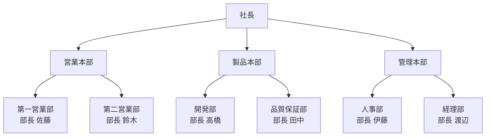

theme: jp-business
lang: ja

# 新体制の組織図
> 3本部6部体制で意思決定を速める

```mermaid
graph TD
A[社長] --> B[営業本部]
A --> C[製品本部]
A --> D[管理本部]
B --> B1[第一営業部<br>部長 佐藤]
B --> B2[第二営業部<br>部長 鈴木]
C --> C1[開発部<br>部長 高橋]
C --> C2[品質保証部<br>部長 田中]
D --> D1[人事部<br>部長 伊藤]
D --> D2[経理部<br>部長 渡辺]
```
