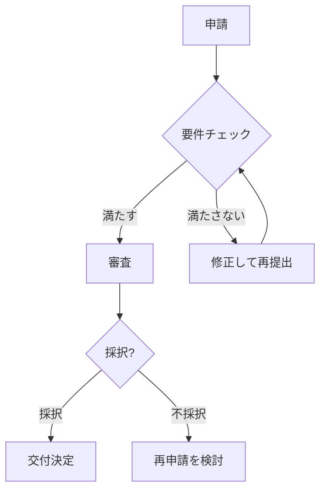

theme: jp-business
lang: ja

# 補助金申請の業務フロー
> 要件を満たさない場合は修正して再提出、不採択でも再申請を検討できる

```mermaid
graph TD
A[申請] --> B{要件チェック}
B -->|満たす| C[審査]
B -->|満たさない| F[修正して再提出]
F --> B
C --> D{採択?}
D -->|採択| E[交付決定]
D -->|不採択| G[再申請を検討]
```
