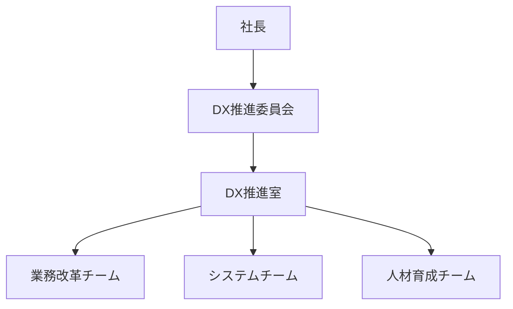

theme: jp-business
lang: ja
footer: 全社DX推進計画
num: on

# 全社DX推進計画
2026〜2028年度 稟議資料
??? 全社DXの承認を求める稟議資料。

# 背景と課題
> 属人化と分断したシステムが成長の足かせになっている
@3
## 業務
- 紙・Excel中心の運用
- 承認に平均7日
- 入力ミスが月30件
## システム
- 部門ごとに個別最適
- データが分断され集計に3日
- 保守費が年々増加
## 人材
- DX人材が不足
- 現場の抵抗感が強い
- 教育体系が未整備

# 目指す姿
> データに基づき全社が即断できる企業へ
- 全業務のデジタル化と自動化
- 経営指標のリアルタイム可視化
- 現場が自走できるDX人材の育成

# 推進体制
> 社長直轄のDX推進室が各本部を横断する


# ロードマップ
> 3フェーズで段階的に展開する
@3 chevron
## フェーズ1 基盤整備
- 2026年度
- 業務の棚卸し
- データ基盤の構築
## フェーズ2 展開
- 2027年度
- 主要業務の自動化
- 全社へ展開
## フェーズ3 高度化
- 2028年度
- AI活用の拡大
- 効果測定と改善

# 投資計画
> 3年間で総額12億円を投資する
```column {title="年度別投資額（億円）" labels=on}
,2026,2027,2028
投資額,5,4.5,2.5
```
## 内訳
- システム開発 7億円
- 研修・体制 2億円
@end

| 項目 | 金額 | 備考 |
|---|---|---|
| システム開発 | 7億円 | 基幹刷新 |
| 基盤・ライセンス | 3億円 | クラウド |
| 研修・体制 | 2億円 | 人材育成 |

# 期待効果
> 3年後に年間4億円のコスト削減を見込む
@3
## 工数削減 {.kpi icon=clock}
-30%
定型業務
## コスト削減 {.kpi icon=yen}
4億円/年
3年後
## 承認期間 {.kpi icon=check}
7日→2日
決裁の迅速化

# リスクと対策
> 現場の定着が最大のリスク
| リスク | 影響 | 対策 |
|---|---|---|
| 現場の抵抗 | 定着遅れ | 推進担当を各部門に配置 |
| 予算超過 | 投資回収の遅れ | 四半期ごとに見直し |
| 人材不足 | 計画遅延 | 外部パートナーを活用 |

# 次のアクション
> 承認後30日以内に推進室を設置する
1. 推進室の設置と責任者の任命
2. 現行業務の棚卸し開始
3. ベンダー選定の着手
