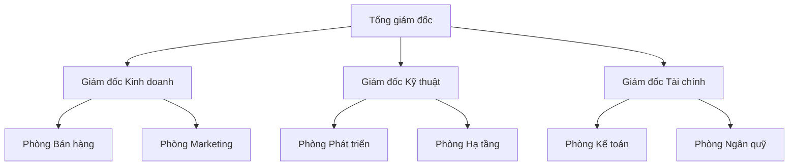

lang: vi

# Sơ đồ tổ chức

```mermaid
graph TD
A[Tổng giám đốc] --> B[Giám đốc Kinh doanh]
A --> C[Giám đốc Kỹ thuật]
A --> D[Giám đốc Tài chính]
B --> B1[Phòng Bán hàng]
B --> B2[Phòng Marketing]
C --> C1[Phòng Phát triển]
C --> C2[Phòng Hạ tầng]
D --> D1[Phòng Kế toán]
D --> D2[Phòng Ngân quỹ]
```
