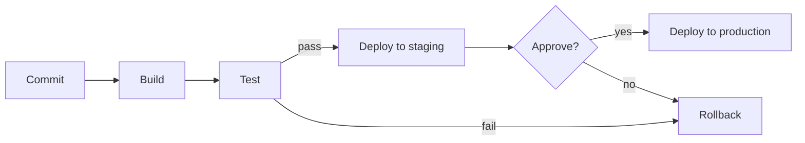

# Deployment pipeline

```mermaid
graph LR
A[Commit] --> B[Build]
B --> C[Test]
C -->|pass| D[Deploy to staging]
C -->|fail| F[Rollback]
D --> E{Approve?}
E -->|yes| G[Deploy to production]
E -->|no| F
```
Every change passes tests and an approval gate before production.
