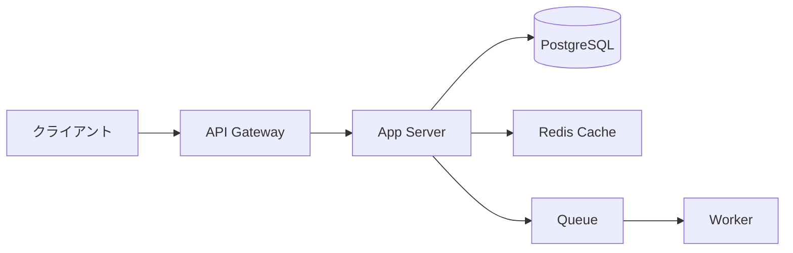

theme: none
lang: ja
colors: bg=#0D1117 fg=#E6EDF3 primary=#58A6FF accent=#3FB950 muted=#8B949E surface=#161B22 border=#30363D
fonts: heading="Yu Gothic" body="Yu Gothic" ea="Yu Gothic" mono="JetBrains Mono"
style: radius=8 title.band=none card.fill=#161B22 table.header.fill=#58A6FF table.header.color=#0D1117

# アーキテクチャ概要
> リクエストはゲートウェイ経由でステートレスな処理層に分散する


# 性能比較
> 新エンジンはレイテンシを約65%削減した
| 指標 | 旧構成 | 新構成 | 改善 |
|-|-|-|-|
| p50 レイテンシ（ms） | 120 | 42 | [-65%]{.badge .success} |
| p99 レイテンシ（ms） | 480 | 160 | [-67%]{.badge .success} |
| スループット（rps） | 3,200 | 9,800 | [+206%]{.badge .success} |
| コスト（月・万円） | 180 | 120 | [-33%]{.badge .success} |

# コード例
> 3行でバッチ処理をキューに投入できる
```python
from kaze import Client

client = Client(api_key="...")
job = client.queue.submit("resize", payload={"id": 42})
print(job.status)
```
