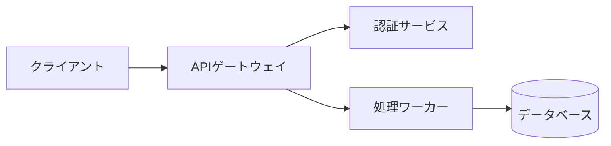

theme: none
lang: ja
colors: bg=#0D1117 fg=#E6EDF3 primary=#58A6FF accent=#3FB950 surface=#161B22 border=#30363D muted=#8B949E
fonts: mono="JetBrains Mono"
style: title.band=none palette=#58A6FF,#3FB950

# アーキテクチャ概要
> リクエストはゲートウェイ経由でマイクロサービスへ分散する


# 性能比較
> 新エンジンは遅延を大幅に削減した
| 指標 | 旧版 | KAZE Cloud |
|-|-|-|
| p95遅延（ms） | 240 | 85 |
| スループット（req/s） | 3,200 | 9,800 |
| 起動時間（秒） | 45 | 8 |

# コード例
> 数行でジョブを投入できる
```python
from kaze import Client

c = Client(token="...")
job = c.jobs.submit("resize", src="s3://in/a.png")
print(job.status)
```
