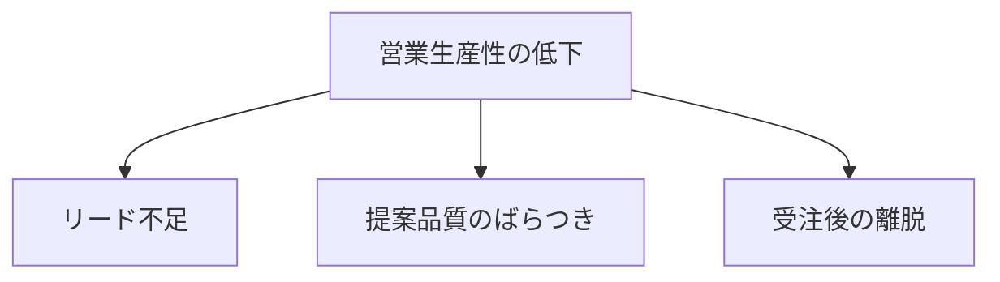

theme: none
lang: ja
density: dense
colors: bg=#FFFFFF fg=#333333 primary=#7B1E3A accent=#6B7280 muted=#6B7280 surface=#F7F3F4 border=#D9C7CD
fonts: heading="Meiryo" body="Meiryo" ea="Meiryo"
style: table.header.fill=#7B1E3A table.header.color=#FFFFFF

# 次期成長戦略の検討
> 2027年度に向けた事業ポートフォリオの再設計
※ 出所: 経営企画部（2026年9月）

# エグゼクティブサマリー
> 市場拡大を背景に、3つの打ち手で営業利益率10%を目指す
## 市場
- 国内市場は年 ==6%== で成長
## 競合
- 上位3社が寡占を強化
## 自社
- 既存顧客基盤に優位性
@end
```table
指標,現状,2027目標
売上(億円),820,1000
営業利益率(%),7.2,10.0
海外比率(%),12,20
```
※ 出所: 社内集計、業界レポート（2026年）

# 市場規模は5年で1.4倍に拡大
> 成長の中心は中堅企業向けセグメント
```bar {title="市場規模（兆円）" labels=on legend=none}
,2022,2023,2024,2025,2026
市場規模,3.2,3.5,3.9,4.2,4.5
```
## 示唆
- 中堅企業向けへ投資を集中
- 大企業向けは提携で補完
※ 出所: 業界団体統計（2026年）

# 課題は3つの要因に分解できる
> 根本原因は営業生産性の低さに集約される

※ 出所: 営業部ヒアリング（2026年8月）

# 決議事項
> 本日の経営会議で以下3点の承認を求める
1. 中堅企業向け投資枠 50億円の承認
2. 営業支援システムの刷新
3. 海外拠点2か所の設立準備
※ 出所: 経営会議資料（2026年10月）
