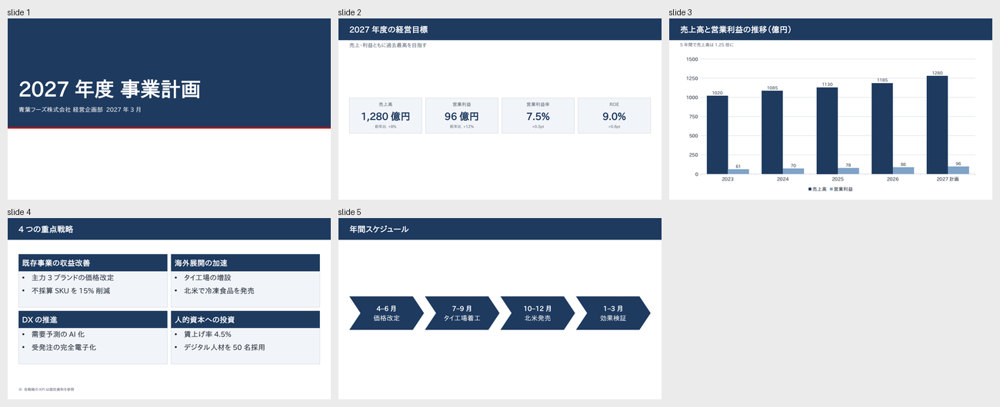
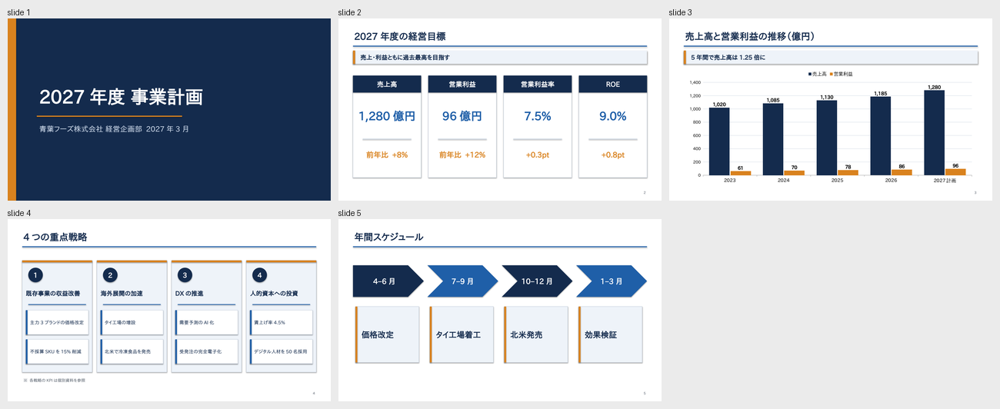
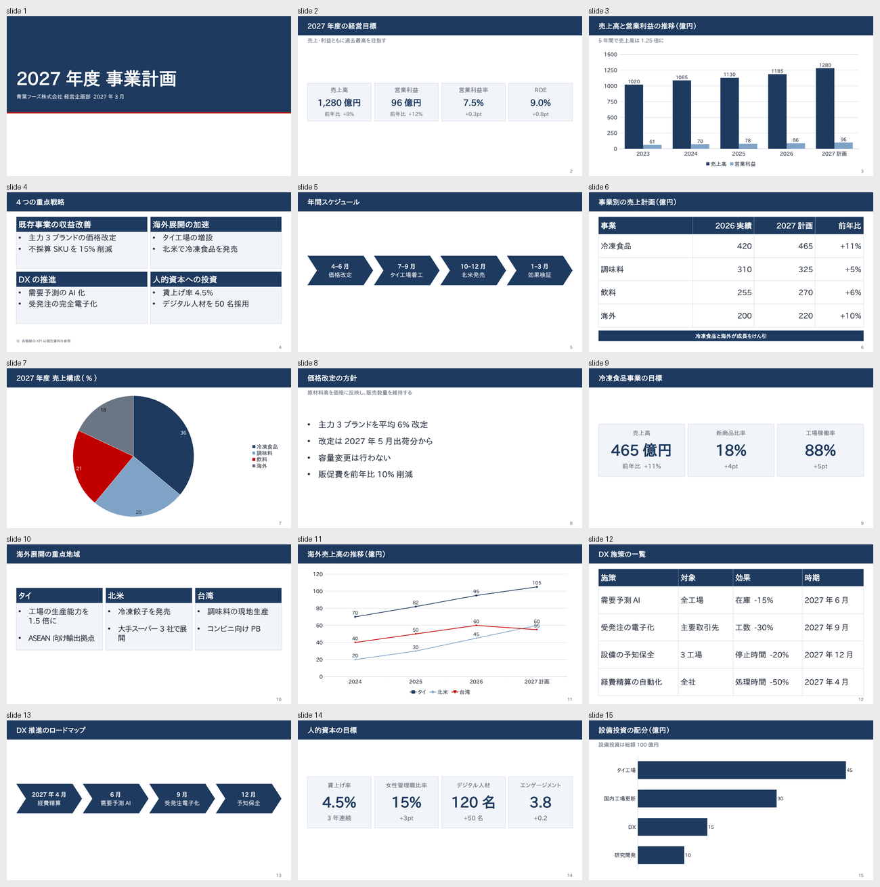
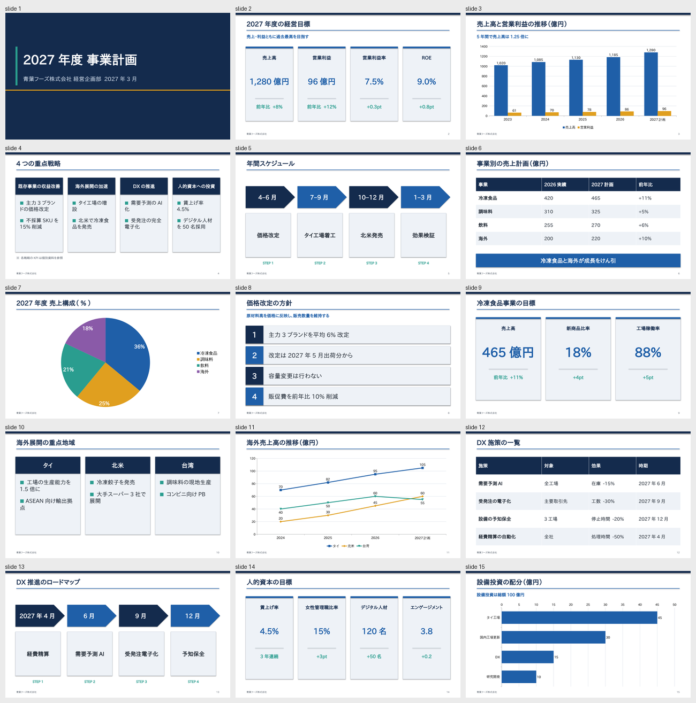
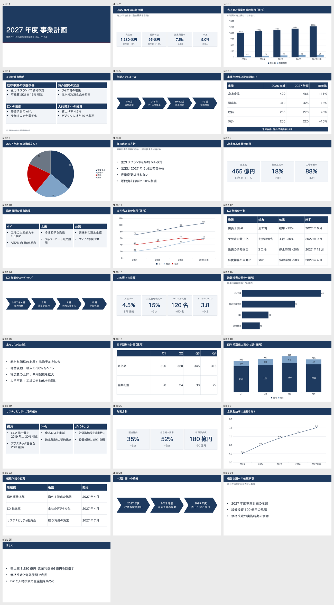
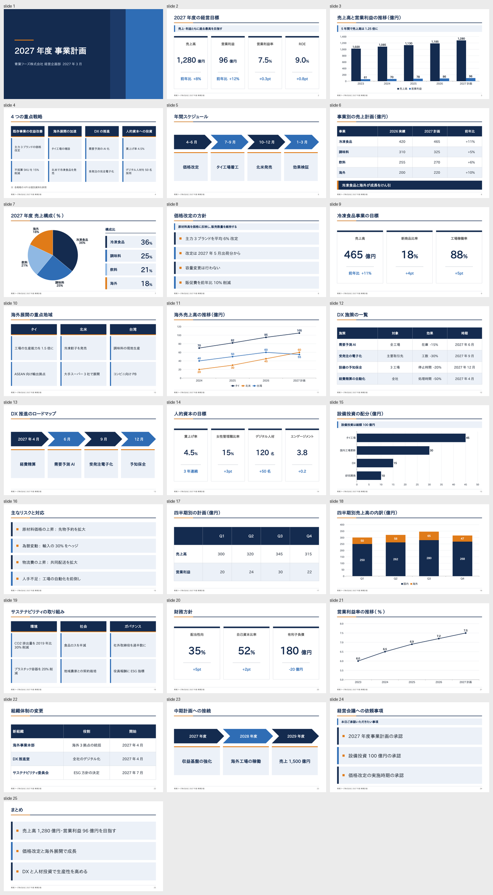

# SlideMark vs python-pptx: one topic at 5, 15 and 25 slides

Generated by `bench/lengthbench/report.py` from `bench/lengthbench/<brief>/result.json`;
do not edit by hand.

Both arms got the same brief (a fictional FY2027 business plan in dense Japanese business style;
the longer briefs extend the shorter one) and the same model (Sonnet, fresh subagent,
one run per arm). The SlideMark arm could read only SKILL.md; the python-pptx arm had
python-pptx only. Both could render previews.

- **Calls:** model API requests from brief to hand-back.
- **Time:** wall clock from the request to the agent's final reply (render and build included).
- **Cost:** units above the shared first call: fresh input + 1.25 x cache write + 0.1 x cache read + 5 x output (docs/AGENT_COST.md).
- **Source:** o200k tokens of the file the agent wrote (`deck.md` or `build.py`).

| Slides | Arm | Calls | Time | Output tokens | Cost | Source tokens | Images viewed | Accepted |
|---|---|---|---|---|---|---|---|---|
| 5 | slidemark | 4 | 18 s | 1,418 | 42,519 | 460 | 2 | yes |
| 5 | python-pptx | 8 | 86 s | 10,053 | 132,818 | 3,187 | 10 | yes |
| 15 | slidemark | 5 | 40 s | 6,733 | 84,674 | 1,271 | 2 | yes |
| 15 | python-pptx | 11 | 140 s | 18,168 | 211,657 | 5,263 | 10 | yes |
| 25 | slidemark | 7 | 70 s | 7,492 | 113,064 | 2,000 | 6 | yes |
| 25 | python-pptx | 10 | 198 s | 41,484 | 356,381 | 8,188 | 7 | yes |

**SlideMark as a share of python-pptx**

| Slides | Calls | Time | Output | Cost | Source |
|---|---|---|---|---|---|
| 5 | 4 / 8 | 21% | 14% | 32% | 14% |
| 15 | 5 / 11 | 29% | 37% | 40% | 24% |
| 25 | 7 / 10 | 35% | 18% | 32% | 24% |

## 5 slides (`bench/lengthbench/t1/`)

**slidemark**: `deck.md`, 460 tokens, 56 lines



<details><summary>deck.md</summary>

````markdown
theme: jp-business
lang: ja

# 2027年度 事業計画
## 青葉フーズ株式会社 経営企画部 2027年3月

# 2027年度の経営目標
> 売上・利益ともに過去最高を目指す
## 売上高 {.kpi}
1,280億円
前年比 +8%
## 営業利益 {.kpi}
96億円
前年比 +12%
## 営業利益率 {.kpi}
7.5%
+0.3pt
## ROE {.kpi}
9.0%
+0.8pt

# 売上高と営業利益の推移（億円）
> 5年間で売上高は1.25倍に
```column {labels=on legend=bottom}
,2023,2024,2025,2026,2027計画
売上高,1020,1085,1130,1185,1280
営業利益,61,70,78,86,96
```

# 4つの重点戦略
## 既存事業の収益改善
- 主力3ブランドの価格改定
- 不採算SKUを15%削減
## 海外展開の加速
- タイ工場の増設
- 北米で冷凍食品を発売
## DXの推進
- 需要予測のAI化
- 受発注の完全電子化
## 人的資本への投資
- 賃上げ率4.5%
- デジタル人材を50名採用
※ 各戦略のKPIは個別資料を参照

# 年間スケジュール
@chevron
## 4–6月
- 価格改定
## 7–9月
- タイ工場着工
## 10–12月
- 北米発売
## 1–3月
- 効果検証
??? 価格改定は主要取引先への説明を3月中に終えます。
````

</details>

**python-pptx**: `build.py`, 3,187 tokens, 230 lines



<details><summary>build.py</summary>

````python
from pptx import Presentation
from pptx.util import Inches, Pt, Emu
from pptx.dml.color import RGBColor
from pptx.enum.shapes import MSO_SHAPE
from pptx.enum.text import PP_ALIGN, MSO_ANCHOR
from pptx.chart.data import CategoryChartData
from pptx.enum.chart import XL_CHART_TYPE, XL_LEGEND_POSITION, XL_LABEL_POSITION
from pptx.oxml.ns import qn
from lxml import etree

NAVY = RGBColor(0x14, 0x2B, 0x4D)
BLUE = RGBColor(0x1F, 0x5F, 0xA8)
LIGHT = RGBColor(0xEE, 0xF3, 0xF9)
GRAY = RGBColor(0x55, 0x5F, 0x6B)
LINE = RGBColor(0xC5, 0xD0, 0xDE)
ACCENT = RGBColor(0xD9, 0x82, 0x1E)
WHITE = RGBColor(255, 255, 255)
FONT = "Yu Gothic"

prs = Presentation()
prs.slide_width = Inches(13.333)
prs.slide_height = Inches(7.5)
SW, SH = 13.333, 7.5
M = 0.6  # side margin


def set_font(run, size, bold=False, color=NAVY):
    f = run.font
    f.size = Pt(size)
    f.bold = bold
    f.color.rgb = color
    f.name = FONT
    rPr = run._r.get_or_add_rPr()
    for tag in ("a:ea", "a:cs"):
        el = rPr.find(qn(tag))
        if el is None:
            el = etree.SubElement(rPr, qn(tag))
        el.set("typeface", FONT)


def text(slide, x, y, w, h, s, size, bold=False, color=NAVY, align=PP_ALIGN.LEFT,
         anchor=MSO_ANCHOR.TOP):
    tb = slide.shapes.add_textbox(Inches(x), Inches(y), Inches(w), Inches(h))
    tf = tb.text_frame
    tf.word_wrap = True
    tf.margin_left = tf.margin_right = Inches(0.05)
    tf.margin_top = tf.margin_bottom = Inches(0.03)
    tf.vertical_anchor = anchor
    p = tf.paragraphs[0]
    p.alignment = align
    r = p.add_run()
    r.text = s
    set_font(r, size, bold, color)
    return tb


def rect(slide, x, y, w, h, fill, line=None, shape=MSO_SHAPE.RECTANGLE):
    s = slide.shapes.add_shape(shape, Inches(x), Inches(y), Inches(w), Inches(h))
    s.fill.solid()
    s.fill.fore_color.rgb = fill
    if line is None:
        s.line.fill.background()
    else:
        s.line.color.rgb = line
        s.line.width = Pt(1)
    s.shadow.inherit = False
    return s


def shape_text(shape, s, size, bold=False, color=WHITE, align=PP_ALIGN.CENTER):
    tf = shape.text_frame
    tf.word_wrap = True
    tf.vertical_anchor = MSO_ANCHOR.MIDDLE
    p = tf.paragraphs[0]
    p.alignment = align
    r = p.add_run()
    r.text = s
    set_font(r, size, bold, color)


def header(slide, title, message=None, page=None):
    t = slide.shapes.title
    t.left, t.top, t.width, t.height = Inches(M), Inches(0.35), Inches(SW - 2 * M), Inches(0.75)
    tf = t.text_frame
    tf.word_wrap = True
    tf.vertical_anchor = MSO_ANCHOR.MIDDLE
    tf.margin_left = Inches(0.05)
    p = tf.paragraphs[0]
    p.alignment = PP_ALIGN.LEFT
    r = p.add_run()
    r.text = title
    set_font(r, 28, True, NAVY)
    rect(slide, M, 1.12, SW - 2 * M, 0.04, BLUE)
    if message:
        bar = rect(slide, M, 1.32, SW - 2 * M, 0.55, LIGHT)
        rect(slide, M, 1.32, 0.09, 0.55, ACCENT)
        text(slide, M + 0.25, 1.32, SW - 2 * M - 0.35, 0.55, message, 18, True, NAVY,
             anchor=MSO_ANCHOR.MIDDLE)
    if page:
        text(slide, SW - M - 1.0, SH - 0.45, 1.0, 0.3, str(page), 10, False, GRAY, PP_ALIGN.RIGHT)


title_only = prs.slide_layouts[5]

# ---------- Slide 1 ----------
s = prs.slides.add_slide(prs.slide_layouts[0])
bg = rect(s, 0, 0, SW, SH, NAVY)
s.shapes._spTree.remove(bg._element)
s.shapes._spTree.insert(2, bg._element)
rect(s, 0, 0, 0.35, SH, ACCENT)
rect(s, 1.2, 4.0, 6.0, 0.05, ACCENT)
t = s.shapes.title
t.left, t.top, t.width, t.height = Inches(1.2), Inches(2.1), Inches(11), Inches(1.6)
t.text_frame.word_wrap = True
t.text_frame.vertical_anchor = MSO_ANCHOR.BOTTOM
p = t.text_frame.paragraphs[0]
p.alignment = PP_ALIGN.LEFT
r = p.add_run(); r.text = "2027年度 事業計画"
set_font(r, 54, True, WHITE)
st = s.placeholders[1]
st.left, st.top, st.width, st.height = Inches(1.2), Inches(4.3), Inches(11), Inches(0.8)
st.text_frame.word_wrap = True
p = st.text_frame.paragraphs[0]
p.alignment = PP_ALIGN.LEFT
r = p.add_run(); r.text = "青葉フーズ株式会社 経営企画部 2027年3月"
set_font(r, 22, False, RGBColor(0xD6, 0xE2, 0xF2))

# ---------- Slide 2 ----------
s = prs.slides.add_slide(title_only)
header(s, "2027年度の経営目標", "売上・利益ともに過去最高を目指す", 2)
kpis = [("売上高", "1,280億円", "前年比 +8%"),
        ("営業利益", "96億円", "前年比 +12%"),
        ("営業利益率", "7.5%", "+0.3pt"),
        ("ROE", "9.0%", "+0.8pt")]
gap = 0.3
cw = (SW - 2 * M - 3 * gap) / 4
top, ch = 2.35, 4.2
for i, (lab, val, note) in enumerate(kpis):
    x = M + i * (cw + gap)
    rect(s, x, top, cw, ch, WHITE, LINE)
    hd = rect(s, x, top, cw, 0.7, NAVY)
    shape_text(hd, lab, 20, True, WHITE)
    text(s, x, top + 0.95, cw, 1.4, val, 34, True, BLUE, PP_ALIGN.CENTER, MSO_ANCHOR.MIDDLE)
    rect(s, x + 0.4, top + 2.6, cw - 0.8, 0.03, LINE)
    text(s, x, top + 2.85, cw, 0.8, note, 22, True, ACCENT, PP_ALIGN.CENTER, MSO_ANCHOR.MIDDLE)

# ---------- Slide 3 ----------
s = prs.slides.add_slide(title_only)
header(s, "売上高と営業利益の推移（億円）", "5年間で売上高は1.25倍に", 3)
cd = CategoryChartData()
cd.categories = ["2023", "2024", "2025", "2026", "2027計画"]
cd.add_series("売上高", (1020, 1085, 1130, 1185, 1280))
cd.add_series("営業利益", (61, 70, 78, 86, 96))
gf = s.shapes.add_chart(XL_CHART_TYPE.COLUMN_CLUSTERED, Inches(M), Inches(2.05),
                        Inches(SW - 2 * M), Inches(4.85), cd)
ch_ = gf.chart
ch_.font.size = Pt(14)
ch_.font.name = FONT
ch_.has_legend = True
ch_.legend.position = XL_LEGEND_POSITION.TOP
ch_.legend.include_in_layout = False
ch_.legend.font.size = Pt(14)
plot = ch_.plots[0]
plot.gap_width = 60
plot.overlap = -5
plot.has_data_labels = True
dl = plot.data_labels
dl.show_value = True
dl.number_format = "#,##0"
dl.number_format_is_linked = False
dl.position = XL_LABEL_POSITION.OUTSIDE_END
dl.font.size = Pt(14)
dl.font.bold = True
for ser, col in zip(plot.series, (NAVY, ACCENT)):
    ser.format.fill.solid()
    ser.format.fill.fore_color.rgb = col
va = ch_.value_axis
va.maximum_scale = 1400
va.minimum_scale = 0
va.major_unit = 200
va.tick_labels.font.size = Pt(12)
va.tick_labels.number_format = "#,##0"
va.tick_labels.number_format_is_linked = False
va.major_gridlines.format.line.color.rgb = LINE
va.format.line.fill.background()
ch_.category_axis.tick_labels.font.size = Pt(14)

# ---------- Slide 4 ----------
s = prs.slides.add_slide(title_only)
header(s, "4つの重点戦略", None, 4)
boxes = [("既存事業の収益改善", ["主力3ブランドの価格改定", "不採算SKUを15%削減"]),
         ("海外展開の加速", ["タイ工場の増設", "北米で冷凍食品を発売"]),
         ("DXの推進", ["需要予測のAI化", "受発注の完全電子化"]),
         ("人的資本への投資", ["賃上げ率4.5%", "デジタル人材を50名採用"])]
gap = 0.2
bw = (SW - 2 * M - 3 * gap) / 4
top, bh = 1.7, 4.6
for i, (hd_, items) in enumerate(boxes):
    x = M + i * (bw + gap)
    rect(s, x, top, bw, bh, LIGHT, LINE)
    rect(s, x, top, bw, 0.08, ACCENT)
    num = rect(s, x + 0.25, top + 0.3, 0.6, 0.6, NAVY, shape=MSO_SHAPE.OVAL)
    shape_text(num, str(i + 1), 20, True, WHITE)
    text(s, x + 0.1, top + 1.0, bw - 0.2, 0.7, hd_, 18, True, NAVY, anchor=MSO_ANCHOR.MIDDLE)
    rect(s, x + 0.25, top + 1.8, bw - 0.5, 0.03, BLUE)
    for j, it in enumerate(items):
        y = top + 2.05 + j * 1.2
        rect(s, x + 0.15, y, bw - 0.3, 1.0, WHITE, LINE)
        rect(s, x + 0.15, y, 0.07, 1.0, BLUE)
        text(s, x + 0.27, y, bw - 0.47, 1.0, it, 14, False, NAVY, anchor=MSO_ANCHOR.MIDDLE)
text(s, M, 6.5, SW - 2 * M - 1.2, 0.4, "※ 各戦略のKPIは個別資料を参照", 12, False, GRAY)

# ---------- Slide 5 ----------
s = prs.slides.add_slide(title_only)
header(s, "年間スケジュール", None, 5)
steps = [("4–6月", "価格改定"), ("7–9月", "タイ工場着工"), ("10–12月", "北米発売"), ("1–3月", "効果検証")]
gap = 0.15
sw_ = (SW - 2 * M - 3 * gap) / 4
for i, (per, what) in enumerate(steps):
    x = M + i * (sw_ + gap)
    ch = rect(s, x, 1.9, sw_, 1.3, NAVY if i % 2 == 0 else BLUE, shape=MSO_SHAPE.PENTAGON if i == 0 else MSO_SHAPE.CHEVRON)
    shape_text(ch, per, 22, True, WHITE)
    ch.text_frame.margin_left = ch.text_frame.margin_right = 0
    rect(s, x + 0.1, 3.6, sw_ - 0.3, 2.3, LIGHT, LINE)
    rect(s, x + 0.1, 3.6, 0.08, 2.3, ACCENT)
    text(s, x + 0.3, 3.6, sw_ - 0.7, 2.3, what, 24, True, NAVY, anchor=MSO_ANCHOR.MIDDLE)
s.notes_slide.notes_text_frame.text = "価格改定は主要取引先への説明を3月中に終えます。"

prs.save("deck.pptx")
````

</details>


## 15 slides (`bench/lengthbench/t2/`)

**slidemark**: `deck.md`, 1,271 tokens, 153 lines



<details><summary>deck.md</summary>

````markdown
theme: jp-business
lang: ja
num: on
sizes: body=20 heading=22 lead=18 caption=14 table=18 footnote=12

# 2027年度 事業計画
## 青葉フーズ株式会社 経営企画部 2027年3月

# 2027年度の経営目標
> 売上・利益ともに過去最高を目指す
## 売上高 {.kpi}
1,280億円
前年比 +8%
## 営業利益 {.kpi}
96億円
前年比 +12%
## 営業利益率 {.kpi}
7.5%
+0.3pt
## ROE {.kpi}
9.0%
+0.8pt

# 売上高と営業利益の推移（億円）
> 5年間で売上高は1.25倍に
```column {labels=on legend=bottom}
,2023,2024,2025,2026,2027計画
売上高,1020,1085,1130,1185,1280
営業利益,61,70,78,86,96
```

# 4つの重点戦略
## 既存事業の収益改善
- 主力3ブランドの価格改定
- 不採算SKUを15%削減
## 海外展開の加速
- タイ工場の増設
- 北米で冷凍食品を発売
## DXの推進
- 需要予測のAI化
- 受発注の完全電子化
## 人的資本への投資
- 賃上げ率4.5%
- デジタル人材を50名採用
※ 各戦略のKPIは個別資料を参照

# 年間スケジュール
@chevron
## 4–6月
- 価格改定
## 7–9月
- タイ工場着工
## 10–12月
- 北米発売
## 1–3月
- 効果検証
??? 価格改定は主要取引先への説明を3月中に終えます。

# 事業別の売上計画（億円）
```table {align=lrrr}
事業,2026実績,2027計画,前年比
冷凍食品,420,465,+11%
調味料,310,325,+5%
飲料,255,270,+6%
海外,200,220,+10%
```
> 冷凍食品と海外が成長をけん引

# 2027年度 売上構成（%）
```pie {labels=on legend=right}
,冷凍食品,調味料,飲料,海外
構成比,36,25,21,18
```

# 価格改定の方針
> 原材料高を価格に反映し、販売数量を維持する
- 主力3ブランドを平均6%改定
- 改定は2027年5月出荷分から
- 容量変更は行わない
- 販促費を前年比10%削減

# 冷凍食品事業の目標
## 売上高 {.kpi}
465億円
前年比 +11%
## 新商品比率 {.kpi}
18%
+4pt
## 工場稼働率 {.kpi}
88%
+5pt

# 海外展開の重点地域
## タイ
- 工場の生産能力を1.5倍に
- ASEAN向け輸出拠点
## 北米
- 冷凍餃子を発売
- 大手スーパー3社で展開
## 台湾
- 調味料の現地生産
- コンビニ向けPB

# 海外売上高の推移（億円）
```line {labels=on legend=bottom}
,2024,2025,2026,2027計画
タイ,70,82,95,105
北米,20,30,45,60
台湾,40,50,60,55
```

# DX施策の一覧
```table {align=llll}
施策,対象,効果,時期
需要予測AI,全工場,在庫 -15%,2027年6月
受発注の電子化,主要取引先,工数 -30%,2027年9月
設備の予知保全,3工場,停止時間 -20%,2027年12月
経費精算の自動化,全社,処理時間 -50%,2027年4月
```

# DX推進のロードマップ
@chevron
## 2027年4月
- 経費精算
## 6月
- 需要予測AI
## 9月
- 受発注電子化
## 12月
- 予知保全

# 人的資本の目標
## 賃上げ率 {.kpi}
4.5%
3年連続
## 女性管理職比率 {.kpi}
15%
+3pt
## デジタル人材 {.kpi}
120名
+50名
## エンゲージメント {.kpi}
3.8
+0.2

# 設備投資の配分（億円）
> 設備投資は総額100億円
```bar {labels=on legend=none}
,タイ工場,国内工場更新,DX,研究開発
投資額,45,30,15,10
```
??? タイ工場は2028年4月の稼働を予定しています。
````

</details>

**python-pptx**: `build.py`, 5,263 tokens, 408 lines



<details><summary>build.py</summary>

````python
from pptx import Presentation
from pptx.util import Inches, Pt, Emu
from pptx.dml.color import RGBColor
from pptx.enum.text import PP_ALIGN, MSO_ANCHOR
from pptx.enum.shapes import MSO_SHAPE
from pptx.chart.data import CategoryChartData
from pptx.enum.chart import XL_CHART_TYPE, XL_LEGEND_POSITION, XL_LABEL_POSITION
from pptx.oxml.ns import qn
from lxml import etree

FONT = "Yu Gothic"
NAVY = RGBColor(0x14, 0x2B, 0x4D)
BLUE = RGBColor(0x1F, 0x5F, 0xA8)
TEAL = RGBColor(0x2A, 0x9D, 0x8F)
AMBER = RGBColor(0xE0, 0x9F, 0x1F)
GRAY = RGBColor(0x59, 0x62, 0x6E)
LIGHT = RGBColor(0xEE, 0xF2, 0xF7)
LINE = RGBColor(0xC9, 0xD2, 0xDE)
WHITE = RGBColor(0xFF, 0xFF, 0xFF)
TEXT = RGBColor(0x22, 0x2B, 0x36)
SERIES = [BLUE, AMBER, TEAL, RGBColor(0x8A, 0x5A, 0xA8)]

prs = Presentation()
prs.slide_width = Inches(13.333)
prs.slide_height = Inches(7.5)
BLANK = prs.slide_layouts[6]
W = 13.333
MX = 0.6  # side margin


def set_font(run, size, bold=False, color=TEXT):
    f = run.font
    f.size = Pt(size)
    f.bold = bold
    f.name = FONT
    f.color.rgb = color
    rPr = run._r.get_or_add_rPr()
    for tag in ("a:ea", "a:cs"):
        el = rPr.find(qn(tag))
        if el is None:
            el = etree.SubElement(rPr, qn(tag))
        el.set("typeface", FONT)


def text(slide, x, y, w, h, s, size=14, bold=False, color=TEXT, align=PP_ALIGN.LEFT,
         anchor=MSO_ANCHOR.TOP, name=None):
    tb = slide.shapes.add_textbox(Inches(x), Inches(y), Inches(w), Inches(h))
    tf = tb.text_frame
    tf.word_wrap = True
    tf.vertical_anchor = anchor
    tf.margin_left = tf.margin_right = Inches(0.05)
    tf.margin_top = tf.margin_bottom = Inches(0.03)
    p = tf.paragraphs[0]
    p.alignment = align
    r = p.add_run()
    r.text = s
    set_font(r, size, bold, color)
    return tb


def rect(slide, x, y, w, h, fill, line=None, shape=MSO_SHAPE.RECTANGLE):
    s = slide.shapes.add_shape(shape, Inches(x), Inches(y), Inches(w), Inches(h))
    s.fill.solid()
    s.fill.fore_color.rgb = fill
    if line is None:
        s.line.fill.background()
    else:
        s.line.color.rgb = line
        s.line.width = Pt(1)
    s.shadow.inherit = False
    return s


def shape_text(s, txt, size, bold=False, color=WHITE, align=PP_ALIGN.CENTER):
    tf = s.text_frame
    tf.word_wrap = True
    tf.vertical_anchor = MSO_ANCHOR.MIDDLE
    p = tf.paragraphs[0]
    p.alignment = align
    r = p.add_run()
    r.text = txt
    set_font(r, size, bold, color)


page = [0]


def new_slide(title, message=None):
    s = prs.slides.add_slide(BLANK)
    page[0] += 1
    rect(s, 0, 0, W, 0.12, NAVY)
    text(s, MX, 0.3, W - 2 * MX, 0.7, title, 28, True, NAVY, anchor=MSO_ANCHOR.MIDDLE)
    rect(s, MX + 0.05, 1.02, W - 2 * MX - 0.1, 0.03, BLUE)
    if message:
        text(s, MX, 1.15, W - 2 * MX, 0.5, message, 18, True, BLUE, anchor=MSO_ANCHOR.MIDDLE)
    text(s, MX, 7.05, 6, 0.3, "青葉フーズ株式会社", 10, False, GRAY)
    text(s, W - MX - 1, 7.05, 1, 0.3, str(page[0]), 10, False, GRAY, align=PP_ALIGN.RIGHT)
    return s


def notes(s, t):
    s.notes_slide.notes_text_frame.text = t


def kpi_slide(title, kpis, message=None):
    s = new_slide(title, message)
    n = len(kpis)
    gap = 0.3
    top = 2.0 if message else 1.5
    h = 4.4 if message else 4.9
    cw = (W - 2 * MX - gap * (n - 1)) / n
    for i, (label, value, note) in enumerate(kpis):
        x = MX + i * (cw + gap)
        rect(s, x, top, cw, h, LIGHT, LINE)
        rect(s, x, top, cw, 0.1, SERIES[i % 3 if i < 3 else 2] if False else BLUE)
        text(s, x + 0.15, top + 0.35, cw - 0.3, 0.6, label, 20, True, NAVY, PP_ALIGN.CENTER,
             MSO_ANCHOR.MIDDLE)
        vs = 34 if n == 4 else 54
        text(s, x + 0.1, top + 1.35, cw - 0.2, 1.4, value, vs, True, BLUE, PP_ALIGN.CENTER,
             MSO_ANCHOR.MIDDLE)
        rect(s, x + cw * 0.2, top + 3.05, cw * 0.6, 0.02, LINE)
        text(s, x + 0.15, top + 3.2, cw - 0.3, 0.7, note, 20, True, TEAL, PP_ALIGN.CENTER,
             MSO_ANCHOR.MIDDLE)
    return s


def box_slide(title, boxes, footnote=None):
    s = new_slide(title)
    n = len(boxes)
    gap = 0.3
    top = 1.5
    h = 4.4 if footnote else 4.6
    cw = (W - 2 * MX - gap * (n - 1)) / n
    hs = 20 if n == 4 else 26
    bs = 22 if n == 4 else 24
    for i, (head, items) in enumerate(boxes):
        x = MX + i * (cw + gap)
        rect(s, x, top, cw, h, LIGHT, LINE)
        hd = rect(s, x, top, cw, 1.0, NAVY)
        shape_text(hd, head, hs, True)
        tb = s.shapes.add_textbox(Inches(x + 0.15), Inches(top + 1.25), Inches(cw - 0.3),
                                  Inches(h - 1.5))
        tf = tb.text_frame
        tf.word_wrap = True
        for j, it in enumerate(items):
            p = tf.paragraphs[0] if j == 0 else tf.add_paragraph()
            p.space_after = Pt(22)
            r = p.add_run()
            r.text = "■ "
            set_font(r, bs - 4, False, TEAL)
            r = p.add_run()
            r.text = it
            set_font(r, bs, False, TEXT)
    if footnote:
        text(s, MX, top + h + 0.2, W - 2 * MX, 0.4, footnote, 13, False, GRAY)
    return s


def process_slide(title, steps):
    s = new_slide(title)
    n = len(steps)
    gap = 0.15
    cw = (W - 2 * MX - gap * (n - 1)) / n
    top = 2.0
    for i, (head, body) in enumerate(steps):
        x = MX + i * (cw + gap)
        ch = rect(s, x, top, cw, 1.3, NAVY if i % 2 == 0 else BLUE, shape=MSO_SHAPE.PENTAGON)
        shape_text(ch, head, 26, True)
        rect(s, x, top + 1.6, cw - 0.25, 2.6, LIGHT, LINE)
        text(s, x + 0.1, top + 1.6, cw - 0.45, 2.6, body, 24, True, TEXT, PP_ALIGN.CENTER,
             MSO_ANCHOR.MIDDLE)
        text(s, x, top + 4.4, cw - 0.25, 0.4, "STEP %d" % (i + 1), 14, True, TEAL, PP_ALIGN.CENTER)
    return s


def style_chart(chart, legend=True, size=14):
    chart.font.size = Pt(size)
    chart.font.name = FONT
    chart.has_title = False
    chart.has_legend = legend
    if legend:
        chart.legend.position = XL_LEGEND_POSITION.BOTTOM
        chart.legend.include_in_layout = False
        chart.legend.font.size = Pt(size)
        chart.legend.font.name = FONT


def chart_slide(title, message, ctype, cats, series, numfmt='#,##0', legend=True,
                gap_width=80):
    s = new_slide(title, message)
    cd = CategoryChartData()
    cd.categories = cats
    for name, vals in series:
        cd.add_series(name, vals)
    top = 1.8 if message else 1.4
    gf = s.shapes.add_chart(ctype, Inches(MX), Inches(top), Inches(W - 2 * MX),
                            Inches(6.95 - top), cd)
    ch = gf.chart
    style_chart(ch, legend)
    plot = ch.plots[0]
    plot.has_data_labels = True
    dl = plot.data_labels
    dl.number_format = numfmt
    dl.number_format_is_linked = False
    dl.font.size = Pt(14)
    dl.font.name = FONT
    dl.show_value = True
    if ctype in (XL_CHART_TYPE.COLUMN_CLUSTERED, XL_CHART_TYPE.BAR_CLUSTERED):
        plot.gap_width = gap_width
        dl.position = XL_LABEL_POSITION.OUTSIDE_END
        va = ch.value_axis
        va.has_major_gridlines = True
        va.major_gridlines.format.line.color.rgb = LINE
        va.tick_labels.font.size = Pt(13)
        va.format.line.fill.background()
        ch.category_axis.tick_labels.font.size = Pt(14)
        for i, ser in enumerate(plot.series):
            ser.format.fill.solid()
            ser.format.fill.fore_color.rgb = SERIES[i % len(SERIES)]
    return s, ch


# 1 cover
s = prs.slides.add_slide(BLANK)
page[0] += 1
rect(s, 0, 0, W, 7.5, NAVY)
rect(s, 0, 4.55, W, 0.06, AMBER)
rect(s, MX, 2.0, 0.12, 2.3, TEAL)
text(s, MX + 0.4, 2.0, 11.5, 1.5, "2027年度 事業計画", 54, True, WHITE, anchor=MSO_ANCHOR.MIDDLE)
text(s, MX + 0.4, 3.5, 11.5, 0.8, "青葉フーズ株式会社 経営企画部 2027年3月", 24, False,
     RGBColor(0xD6, 0xE2, 0xF0), anchor=MSO_ANCHOR.MIDDLE)

# 2 KPI
kpi_slide("2027年度の経営目標", [
    ("売上高", "1,280億円", "前年比 +8%"),
    ("営業利益", "96億円", "前年比 +12%"),
    ("営業利益率", "7.5%", "+0.3pt"),
    ("ROE", "9.0%", "+0.8pt"),
], "売上・利益ともに過去最高を目指す")

# 3 column chart
s, ch = chart_slide("売上高と営業利益の推移（億円）", "5年間で売上高は1.25倍に",
                    XL_CHART_TYPE.COLUMN_CLUSTERED,
                    ["2023", "2024", "2025", "2026", "2027計画"],
                    [("売上高", (1020, 1085, 1130, 1185, 1280)),
                     ("営業利益", (61, 70, 78, 86, 96))])

# 4 boxes
box_slide("4つの重点戦略", [
    ("既存事業の収益改善", ["主力3ブランドの価格改定", "不採算SKUを15%削減"]),
    ("海外展開の加速", ["タイ工場の増設", "北米で冷凍食品を発売"]),
    ("DXの推進", ["需要予測のAI化", "受発注の完全電子化"]),
    ("人的資本への投資", ["賃上げ率4.5%", "デジタル人材を50名採用"]),
], "※ 各戦略のKPIは個別資料を参照")

# 5 process
s = process_slide("年間スケジュール", [
    ("4–6月", "価格改定"), ("7–9月", "タイ工場着工"),
    ("10–12月", "北米発売"), ("1–3月", "効果検証")])
notes(s, "価格改定は主要取引先への説明を3月中に終えます。")


def table_slide(title, rows, conclusion_flag=False, colw=None):
    s = new_slide(title)
    nr, nc = len(rows), len(rows[0])
    top = 1.5
    rh = 0.8 if conclusion_flag else 1.05
    height = rh * nr
    gf = s.shapes.add_table(nr, nc, Inches(MX), Inches(top), Inches(W - 2 * MX), Inches(height))
    tbl = gf.table
    tblPr = gf._element.graphic.graphicData.tbl.tblPr
    # remove default style banding look by explicit fills
    if colw:
        for i, cw in enumerate(colw):
            tbl.columns[i].width = Inches(cw)
    for r in range(nr):
        tbl.rows[r].height = Inches(rh)
        for c in range(nc):
            cell = tbl.cell(r, c)
            cell.vertical_anchor = MSO_ANCHOR.MIDDLE
            cell.margin_left = cell.margin_right = Inches(0.15)
            cell.fill.solid()
            if r == 0:
                cell.fill.fore_color.rgb = NAVY
            else:
                cell.fill.fore_color.rgb = LIGHT if r % 2 == 0 else WHITE
            tf = cell.text_frame
            p = tf.paragraphs[0]
            p.alignment = PP_ALIGN.LEFT if c == 0 or not rows[r][c].replace(",", "").lstrip("+-").rstrip("%").isdigit() and c == 0 else PP_ALIGN.LEFT
            run = p.add_run()
            run.text = rows[r][c]
            set_font(run, 20 if r else 20, r == 0 or c == 0, WHITE if r == 0 else TEXT)
    return s, top + height


# 6 table
rows = [["事業", "2026実績", "2027計画", "前年比"],
        ["冷凍食品", "420", "465", "+11%"],
        ["調味料", "310", "325", "+5%"],
        ["飲料", "255", "270", "+6%"],
        ["海外", "200", "220", "+10%"]]
s, bottom = table_slide("事業別の売上計画（億円）", rows, True, colw=[3.9, 2.8, 2.8, 2.633])
for r in range(1, 5):
    pass
bar = rect(s, MX, 6.0, W - 2 * MX, 0.8, BLUE)
shape_text(bar, "冷凍食品と海外が成長をけん引", 24, True, WHITE)

# 7 pie
s, ch = chart_slide("2027年度 売上構成（%）", None, XL_CHART_TYPE.PIE,
                    ["冷凍食品", "調味料", "飲料", "海外"], [("構成比", (36, 25, 21, 18))],
                    numfmt='0"%"')
ch.legend.position = XL_LEGEND_POSITION.RIGHT
ch.legend.font.size = Pt(18)
plot = ch.plots[0]
plot.data_labels.font.size = Pt(22)
plot.data_labels.font.bold = True
plot.data_labels.font.color.rgb = WHITE
plot.data_labels.position = XL_LABEL_POSITION.INSIDE_END
for i, pt_color in enumerate([BLUE, AMBER, TEAL, RGBColor(0x8A, 0x5A, 0xA8)]):
    pt = plot.series[0].points[i]
    pt.format.fill.solid()
    pt.format.fill.fore_color.rgb = pt_color

# 8 bullets
s = new_slide("価格改定の方針", "原材料高を価格に反映し、販売数量を維持する")
items = ["主力3ブランドを平均6%改定", "改定は2027年5月出荷分から", "容量変更は行わない",
         "販促費を前年比10%削減"]
for i, it in enumerate(items):
    y = 2.0 + i * 1.22
    rect(s, MX, y, W - 2 * MX, 1.05, LIGHT, LINE)
    n = rect(s, MX, y, 1.05, 1.05, NAVY if i % 2 == 0 else BLUE)
    shape_text(n, str(i + 1), 32, True)
    text(s, MX + 1.3, y, W - 2 * MX - 1.5, 1.05, it, 26, False, TEXT, anchor=MSO_ANCHOR.MIDDLE)

# 9 KPI x3
kpi_slide("冷凍食品事業の目標", [
    ("売上高", "465億円", "前年比 +11%"),
    ("新商品比率", "18%", "+4pt"),
    ("工場稼働率", "88%", "+5pt"),
])

# 10 boxes x3
box_slide("海外展開の重点地域", [
    ("タイ", ["工場の生産能力を1.5倍に", "ASEAN向け輸出拠点"]),
    ("北米", ["冷凍餃子を発売", "大手スーパー3社で展開"]),
    ("台湾", ["調味料の現地生産", "コンビニ向けPB"]),
])

# 11 line chart
s, ch = chart_slide("海外売上高の推移（億円）", None, XL_CHART_TYPE.LINE_MARKERS,
                    ["2024", "2025", "2026", "2027計画"],
                    [("タイ", (70, 82, 95, 105)), ("北米", (20, 30, 45, 60)),
                     ("台湾", (40, 50, 60, 55))])
plot = ch.plots[0]
plot.data_labels.position = XL_LABEL_POSITION.ABOVE
for i, ser in enumerate(plot.series):
    ser.smooth = False
    ser.format.line.color.rgb = SERIES[i]
    ser.format.line.width = Pt(3.5)
    ser.marker.format.fill.solid()
    ser.marker.format.fill.fore_color.rgb = SERIES[i]
    ser.marker.format.line.color.rgb = SERIES[i]
    ser.marker.size = 9
va = ch.value_axis
va.has_major_gridlines = True
va.major_gridlines.format.line.color.rgb = LINE
va.tick_labels.font.size = Pt(13)
ch.category_axis.tick_labels.font.size = Pt(14)
plot.series[2].data_labels.position = XL_LABEL_POSITION.BELOW
dlp = plot.series[2].points[2].data_label
dlp.position = XL_LABEL_POSITION.ABOVE
dlp.font.size = Pt(14)
plot.series[2].data_labels.show_value = True
plot.series[2].data_labels.font.size = Pt(14)
plot.series[2].data_labels.number_format = '#,##0'
plot.series[2].data_labels.number_format_is_linked = False

# 12 table
rows = [["施策", "対象", "効果", "時期"],
        ["需要予測AI", "全工場", "在庫 -15%", "2027年6月"],
        ["受発注の電子化", "主要取引先", "工数 -30%", "2027年9月"],
        ["設備の予知保全", "3工場", "停止時間 -20%", "2027年12月"],
        ["経費精算の自動化", "全社", "処理時間 -50%", "2027年4月"]]
table_slide("DX施策の一覧", rows, colw=[3.9, 2.8, 2.8, 2.633])

# 13 process
process_slide("DX推進のロードマップ", [
    ("2027年4月", "経費精算"), ("6月", "需要予測AI"),
    ("9月", "受発注電子化"), ("12月", "予知保全")])

# 14 KPI x4
kpi_slide("人的資本の目標", [
    ("賃上げ率", "4.5%", "3年連続"),
    ("女性管理職比率", "15%", "+3pt"),
    ("デジタル人材", "120名", "+50名"),
    ("エンゲージメント", "3.8", "+0.2"),
])

# 15 bar chart
s, ch = chart_slide("設備投資の配分（億円）", "設備投資は総額100億円", XL_CHART_TYPE.BAR_CLUSTERED,
                    ["タイ工場", "国内工場更新", "DX", "研究開発"], [("投資額", (45, 30, 15, 10))],
                    legend=False, gap_width=60)
ch.category_axis.reverse_order = True
ch.value_axis.tick_label_position  # keep
notes(s, "タイ工場は2028年4月の稼働を予定しています。")

prs.save("deck.pptx")
````

</details>


## 25 slides (`bench/lengthbench/t3/`)

**slidemark**: `deck.md`, 2,000 tokens, 232 lines



<details><summary>deck.md</summary>

````markdown
theme: jp-business
lang: ja
title: 2027年度 事業計画
size: 16:9
sizes: heading=20 body=20 lead=20 caption=16 footnote=14 table=18

# 2027年度 事業計画
## 青葉フーズ株式会社 経営企画部 2027年3月

# 2027年度の経営目標
> 売上・利益ともに過去最高を目指す
## 売上高 {.kpi}
1,280億円
前年比 +8%
## 営業利益 {.kpi}
96億円
前年比 +12%
## 営業利益率 {.kpi}
7.5%
+0.3pt
## ROE {.kpi}
9.0%
+0.8pt

# 売上高と営業利益の推移（億円）
> 5年間で売上高は1.25倍に
```column {labels=on legend=bottom}
,2023,2024,2025,2026,2027計画
売上高,1020,1085,1130,1185,1280
営業利益,61,70,78,86,96
```

# 4つの重点戦略
## 既存事業の収益改善
- 主力3ブランドの価格改定
- 不採算SKUを15%削減
## 海外展開の加速
- タイ工場の増設
- 北米で冷凍食品を発売
## DXの推進
- 需要予測のAI化
- 受発注の完全電子化
## 人的資本への投資
- 賃上げ率4.5%
- デジタル人材を50名採用
※ 各戦略のKPIは個別資料を参照

# 年間スケジュール
@chevron
## 4–6月
- 価格改定
## 7–9月
- タイ工場着工
## 10–12月
- 北米発売
## 1–3月
- 効果検証
??? 価格改定は主要取引先への説明を3月中に終えます。

# 事業別の売上計画（億円）
```table {align=lrrr}
事業,2026実績,2027計画,前年比
冷凍食品,420,465,+11%
調味料,310,325,+5%
飲料,255,270,+6%
海外,200,220,+10%
```
> 冷凍食品と海外が成長をけん引

# 2027年度 売上構成（%）
```pie {labels=on legend=right}
,冷凍食品,調味料,飲料,海外
構成比,36,25,21,18
```

# 価格改定の方針
> 原材料高を価格に反映し、販売数量を維持する
- 主力3ブランドを平均6%改定
- 改定は2027年5月出荷分から
- 容量変更は行わない
- 販促費を前年比10%削減

# 冷凍食品事業の目標
## 売上高 {.kpi}
465億円
前年比 +11%
## 新商品比率 {.kpi}
18%
+4pt
## 工場稼働率 {.kpi}
88%
+5pt

# 海外展開の重点地域
## タイ
- 工場の生産能力を1.5倍に
- ASEAN向け輸出拠点
## 北米
- 冷凍餃子を発売
- 大手スーパー3社で展開
## 台湾
- 調味料の現地生産
- コンビニ向けPB

# 海外売上高の推移（億円）
```line {labels=on legend=bottom}
,2024,2025,2026,2027計画
タイ,70,82,95,105
北米,20,30,45,60
台湾,40,50,60,55
```

# DX施策の一覧
```table
施策,対象,効果,時期
需要予測AI,全工場,在庫 -15%,2027年6月
受発注の電子化,主要取引先,工数 -30%,2027年9月
設備の予知保全,3工場,停止時間 -20%,2027年12月
経費精算の自動化,全社,処理時間 -50%,2027年4月
```

# DX推進のロードマップ
@chevron
## 2027年4月
- 経費精算
## 6月
- 需要予測AI
## 9月
- 受発注電子化
## 12月
- 予知保全

# 人的資本の目標
## 賃上げ率 {.kpi}
4.5%
3年連続
## 女性管理職比率 {.kpi}
15%
+3pt
## デジタル人材 {.kpi}
120名
+50名
## エンゲージメント {.kpi}
3.8
+0.2

# 設備投資の配分（億円）
> 設備投資は総額100億円
```bar {labels=on legend=none}
,タイ工場,国内工場更新,DX,研究開発
投資額,45,30,15,10
```
??? タイ工場は2028年4月の稼働を予定しています。

# 主なリスクと対応
- 原材料価格の上昇: 先物予約を拡大
- 為替変動: 輸入の30%をヘッジ
- 物流費の上昇: 共同配送を拡大
- 人手不足: 工場の自動化を前倒し

# 四半期別の計画（億円）
```table {align=lrrrr}
,Q1,Q2,Q3,Q4
売上高,300,320,345,315
営業利益,20,24,30,22
```

# 四半期別売上高の内訳（億円）
```stacked-column {labels=on legend=bottom}
,Q1,Q2,Q3,Q4
国内,250,262,280,268
海外,50,58,65,47
```

# サステナビリティの取り組み
@3
## 環境
- CO2排出量を2019年比30%削減
- プラスチック容器を20%削減
## 社会
- 食品ロスを半減
- 地域農家との契約栽培
## ガバナンス
- 社外取締役を過半数に
- 役員報酬にESG指標

# 財務方針
## 配当性向 {.kpi}
35%
+5pt
## 自己資本比率 {.kpi}
52%
+2pt
## 有利子負債 {.kpi}
180億円
-20億円

# 営業利益率の推移（%）
```line {labels=on legend=none fmt="0.0"}
,2023,2024,2025,2026,2027計画
営業利益率,6.0,6.5,6.9,7.2,7.5
```

# 組織体制の変更
```table
新組織,役割,開始
海外事業本部,海外3拠点の統括,2027年4月
DX推進室,全社のデジタル化,2027年4月
サステナビリティ委員会,ESG方針の決定,2027年7月
```

# 中期計画への接続
@chevron
## 2027年度
- 収益基盤の強化
## 2028年度
- 海外工場の稼働
## 2029年度
- 売上1,500億円

# 経営会議への依頼事項
> 本日ご承認いただきたい事項
- 2027年度事業計画の承認
- 設備投資100億円の承認
- 価格改定の実施時期の承認
??? 設備投資のうちタイ工場分は別途取締役会に付議します。

# まとめ
- 売上高1,280億円・営業利益96億円を目指す
- 価格改定と海外展開で成長
- DXと人材投資で生産性を高める
````

</details>

**python-pptx**: `build.py`, 8,188 tokens, 597 lines



<details><summary>build.py</summary>

````python
import re
from pptx import Presentation
from pptx.util import Inches, Pt, Emu
from pptx.dml.color import RGBColor
from pptx.enum.text import PP_ALIGN, MSO_ANCHOR
from pptx.enum.shapes import MSO_SHAPE
from pptx.chart.data import CategoryChartData
from pptx.enum.chart import XL_MARKER_STYLE, XL_CHART_TYPE, XL_LEGEND_POSITION, XL_LABEL_POSITION
from pptx.oxml.ns import qn
from lxml import etree

FONT = "Yu Gothic"
NAVY = RGBColor(0x14, 0x2B, 0x4F)
BLUE = RGBColor(0x2F, 0x6D, 0xB5)
SKY = RGBColor(0x8F, 0xB8, 0xE3)
LIGHT = RGBColor(0xEC, 0xF1, 0xF8)
GRAY = RGBColor(0x59, 0x59, 0x59)
LGRAY = RGBColor(0xBF, 0xC5, 0xCE)
ORANGE = RGBColor(0xE0, 0x7B, 0x18)
WHITE = RGBColor(0xFF, 0xFF, 0xFF)
TEXT = RGBColor(0x22, 0x2B, 0x38)

prs = Presentation()
prs.slide_width = Inches(13.333)
prs.slide_height = Inches(7.5)
SW = 13.333
LM = 0.6
CW = SW - 2 * LM
BOT = 6.8
FOOT = "青葉フーズ株式会社｜2027年度 事業計画"


def set_font(run, size, bold=False, color=TEXT, name=FONT):
    f = run.font
    f.size = Pt(size)
    f.bold = bold
    f.color.rgb = color
    f.name = name
    rPr = run._r.get_or_add_rPr()
    for tag in ("a:ea", "a:cs"):
        if rPr.find(qn(tag)) is None:
            e = etree.SubElement(rPr, qn(tag))
            e.set("typeface", name)
    # keep schema order: latin, ea, cs must follow fill
    latin = rPr.find(qn("a:latin"))
    ea = rPr.find(qn("a:ea"))
    cs = rPr.find(qn("a:cs"))
    if latin is not None:
        latin.addnext(ea)
        ea.addnext(cs)


def fill_tf(tf, paras, size, bold=False, color=TEXT, align=PP_ALIGN.LEFT, anchor=MSO_ANCHOR.TOP,
            margins=(0.1, 0.05, 0.1, 0.05), spacing=None):
    tf.word_wrap = True
    tf.auto_size = None
    tf.vertical_anchor = anchor
    tf.margin_left, tf.margin_top, tf.margin_right, tf.margin_bottom = [Inches(m) for m in margins]
    if isinstance(paras, str):
        paras = [paras]
    for i, p in enumerate(paras):
        para = tf.paragraphs[0] if i == 0 else tf.add_paragraph()
        para.alignment = align
        if spacing:
            para.space_after = Pt(spacing)
        runs = p if isinstance(p, list) else [(p, size, bold, color)]
        for t, s, b, c in runs:
            r = para.add_run()
            r.text = t
            set_font(r, s, b, c)


def tb(slide, x, y, w, h, paras, size, **kw):
    s = slide.shapes.add_textbox(Inches(x), Inches(y), Inches(w), Inches(h))
    fill_tf(s.text_frame, paras, size, **kw)
    return s


def rect(slide, x, y, w, h, fill, line=None, shape=MSO_SHAPE.RECTANGLE):
    s = slide.shapes.add_shape(shape, Inches(x), Inches(y), Inches(w), Inches(h))
    s.shadow.inherit = False
    st = s._element.find(qn("p:style"))
    if st is not None:
        s._element.remove(st)
    if fill is None:
        s.fill.background()
    else:
        s.fill.solid()
        s.fill.fore_color.rgb = fill
    if line is None:
        s.line.fill.background()
    else:
        s.line.color.rgb = line
        s.line.width = Pt(0.75)
    return s


def shape_text(s, paras, size, **kw):
    fill_tf(s.text_frame, paras, size, **kw)


page_no = [0]


def new_slide(title, msg=None, notes=None):
    s = prs.slides.add_slide(prs.slide_layouts[5])
    page_no[0] += 1
    t = s.shapes.title
    t.left, t.top, t.width, t.height = Inches(LM), Inches(0.3), Inches(CW), Inches(0.8)
    fill_tf(t.text_frame, title, 28, bold=True, color=NAVY, anchor=MSO_ANCHOR.MIDDLE, margins=(0, 0.02, 0, 0.02))
    rect(s, LM, 1.12, CW, 0.04, NAVY)
    rect(s, LM, 1.12, 1.6, 0.04, ORANGE)
    top = 1.5
    if msg:
        rect(s, LM, 1.35, CW, 0.55, LIGHT)
        rect(s, LM, 1.35, 0.09, 0.55, BLUE)
        tb(s, LM + 0.25, 1.35, CW - 0.35, 0.55, msg, 18, bold=True, color=NAVY, anchor=MSO_ANCHOR.MIDDLE)
        top = 2.1
    # footer
    rect(s, LM, 7.0, CW, 0.01, LGRAY)
    tb(s, LM, 7.04, 8, 0.3, FOOT, 10, color=GRAY, margins=(0, 0, 0, 0), anchor=MSO_ANCHOR.MIDDLE)
    tb(s, SW - LM - 1.5, 7.04, 1.5, 0.3, str(page_no[0]), 10, color=GRAY, align=PP_ALIGN.RIGHT,
       margins=(0, 0, 0, 0), anchor=MSO_ANCHOR.MIDDLE)
    if notes:
        s.notes_slide.notes_text_frame.text = notes
    return s, top


# ---------- slide builders ----------
def cover(title, sub):
    s = prs.slides.add_slide(prs.slide_layouts[0])
    page_no[0] += 1
    rect(s, 0, 0, SW, 7.5, NAVY)
    rect(s, 8.9, 0, 4.433, 7.5, RGBColor(0x1C, 0x3A, 0x68))
    rect(s, 10.2, 0, 3.133, 7.5, BLUE)
    rect(s, 0.9, 2.55, 1.6, 0.07, ORANGE)
    # send placeholders to front by re-adding order: reposition placeholders
    t = s.shapes.title
    t.left, t.top, t.width, t.height = Inches(0.9), Inches(2.75), Inches(8.6), Inches(1.4)
    fill_tf(t.text_frame, title, 48, bold=True, color=WHITE, anchor=MSO_ANCHOR.MIDDLE, margins=(0, 0, 0, 0))
    st = s.placeholders[1]
    st.left, st.top, st.width, st.height = Inches(0.9), Inches(4.4), Inches(8.6), Inches(0.9)
    fill_tf(st.text_frame, sub, 20, color=RGBColor(0xD6, 0xE2, 0xF3), anchor=MSO_ANCHOR.TOP, margins=(0, 0, 0, 0))
    # move placeholders above decorative shapes
    tree = s.shapes._spTree
    for ph in (t, st):
        tree.remove(ph._element)
        tree.append(ph._element)
    return s


def kpi_slide(title, kpis, msg=None):
    s, top = new_slide(title, msg)
    n = len(kpis)
    gap = 0.3
    w = (CW - gap * (n - 1)) / n
    region = BOT - top
    h = min(region - 0.1, 4.4)
    y = top + (region - h) / 2
    big, unit = (42, 22) if n >= 4 else (60, 32)
    for i, (label, value, note) in enumerate(kpis):
        x = LM + i * (w + gap)
        rect(s, x, y, w, h, WHITE, line=LGRAY)
        rect(s, x, y, w, 0.12, NAVY)
        tb(s, x, y + 0.3, w, 0.7, label, 20, bold=True, color=GRAY, align=PP_ALIGN.CENTER, anchor=MSO_ANCHOR.MIDDLE)
        m = re.match(r"^([\d.,]+)(.*)$", value)
        runs = [(m.group(1), big, True, NAVY)]
        if m.group(2):
            runs.append((m.group(2), unit, True, NAVY))
        tb(s, x, y + 1.05, w, h - 2.55, [runs], big, align=PP_ALIGN.CENTER, anchor=MSO_ANCHOR.MIDDLE,
           margins=(0.05, 0, 0.05, 0))
        rect(s, x + w * 0.2, y + h - 1.4, w * 0.6, 0.02, LGRAY)
        tb(s, x, y + h - 1.3, w, 0.9, note, 22, bold=True, color=BLUE, align=PP_ALIGN.CENTER,
           anchor=MSO_ANCHOR.MIDDLE)
    return s


def boxes_slide(title, boxes, foot=None, msg=None):
    s, top = new_slide(title, msg)
    n = len(boxes)
    gap = 0.3
    w = (CW - gap * (n - 1)) / n
    bottom = BOT - (0.5 if foot else 0)
    hh = 0.85
    size = 20 if n == 3 else 17
    item_h = (bottom - top - hh - 0.15 * 3) / 2
    for i, (head, items) in enumerate(boxes):
        x = LM + i * (w + gap)
        hd = rect(s, x, top, w, hh, NAVY)
        shape_text(hd, head, 22 if n == 3 else 20, bold=True, color=WHITE, align=PP_ALIGN.CENTER,
                   anchor=MSO_ANCHOR.MIDDLE)
        rect(s, x, top + hh, w, 0.06, ORANGE)
        for j, it in enumerate(items):
            y = top + hh + 0.15 + j * (item_h + 0.15)
            rect(s, x, y, w, item_h, LIGHT)
            rect(s, x, y, 0.09, item_h, BLUE)
            tb(s, x + 0.2, y, w - 0.3, item_h, it, size, bold=False, color=TEXT, anchor=MSO_ANCHOR.MIDDLE)
    if foot:
        tb(s, LM, BOT - 0.4, CW, 0.4, foot, 14, color=GRAY, anchor=MSO_ANCHOR.MIDDLE, margins=(0, 0, 0, 0))
    return s


def steps_slide(title, steps, notes=None, msg=None):
    s, top = new_slide(title, msg, notes)
    n = len(steps)
    region = BOT - top
    gap = 0.15
    w = (CW - gap * (n - 1) + 0.0) / n
    ch = 1.2
    dh = min(2.4, region - ch - 0.5)
    block = ch + 0.25 + dh
    y = top + (region - block) / 2
    for i, (lab, desc) in enumerate(steps):
        x = LM + i * (w + gap)
        shp = MSO_SHAPE.PENTAGON if i == 0 else MSO_SHAPE.CHEVRON
        c = rect(s, x, y, w + (0.0 if i == n - 1 else 0.25), ch, NAVY if i % 2 == 0 else BLUE, shape=shp)
        shape_text(c, lab, 22, bold=True, color=WHITE, align=PP_ALIGN.CENTER, anchor=MSO_ANCHOR.MIDDLE,
                   margins=(0.35, 0.05, 0.25, 0.05))
        cy = y + ch + 0.25
        rect(s, x, cy, w - 0.1, dh, LIGHT)
        rect(s, x, cy, w - 0.1, 0.07, ORANGE)
        tb(s, x, cy + 0.07, w - 0.1, dh - 0.07, desc, 26 if n < 4 else 24, bold=True, color=NAVY,
           align=PP_ALIGN.CENTER, anchor=MSO_ANCHOR.MIDDLE)
    return s


def table_slide(title, rows, concl=None, msg=None, first_col_bold=True):
    s, top = new_slide(title, msg)
    nr, nc = len(rows), len(rows[0])
    bottom = BOT - (1.0 if concl else 0)
    rh = min(1.5 if nr <= 3 else (1.15 if nr <= 4 else 0.95), (bottom - top) / nr)
    th = rh * nr
    y = top + (0 if concl else max(0, ((bottom - top) - th) / 2))
    gs = s.shapes.add_table(nr, nc, Inches(LM), Inches(y), Inches(CW), Inches(th))
    tbl = gs.table
    # strip default style banding
    tblPr = tbl._tbl.tblPr
    tblPr.set("firstRow", "0")
    tblPr.set("bandRow", "0")
    c0 = 3.6 if nc == 3 or nc == 4 else 3.0
    if nc == 5:
        c0 = 2.5
    first = {3: 4.4, 4: 3.4, 5: 2.4}[nc]
    rest = (CW - first) / (nc - 1)
    tbl.columns[0].width = Inches(first)
    for k in range(1, nc):
        tbl.columns[k].width = Inches(rest)
    numeric_cols = set()
    for k in range(1, nc):
        if all(re.match(r"^[+\-−]?[\d.,]+%?$", rows[r][k]) for r in range(1, nr)):
            numeric_cols.add(k)
    for r in range(nr):
        tbl.rows[r].height = Inches(rh)
        for c in range(nc):
            cell = tbl.cell(r, c)
            cell.vertical_anchor = MSO_ANCHOR.MIDDLE
            cell.margin_left = cell.margin_right = Inches(0.15)
            cell.fill.solid()
            if r == 0:
                cell.fill.fore_color.rgb = NAVY
                col, b = WHITE, True
            else:
                cell.fill.fore_color.rgb = LIGHT if r % 2 == 0 else WHITE
                col, b = TEXT, (c == 0 and first_col_bold)
                if c == 0:
                    col = NAVY
            tf = cell.text_frame
            tf.word_wrap = True
            p = tf.paragraphs[0]
            p.alignment = PP_ALIGN.RIGHT if (c in numeric_cols) else (PP_ALIGN.LEFT if c == 0 else PP_ALIGN.CENTER)
            if c in numeric_cols:
                cell.margin_right = Inches(0.6)
            run = p.add_run()
            run.text = rows[r][c]
            set_font(run, 22 if nr <= 4 else 20, b, col)
            # thin borders
            tcPr = cell._tc.get_or_add_tcPr()
            for tag in ("a:lnL", "a:lnR", "a:lnT", "a:lnB"):
                ln = etree.SubElement(tcPr, qn(tag))
                ln.set("w", "9525")
                sf = etree.SubElement(ln, qn("a:solidFill"))
                clr = etree.SubElement(sf, qn("a:srgbClr"))
                clr.set("val", "BFC5CE")
            # borders must precede fill in tcPr
            fill_el = tcPr.find(qn("a:solidFill"))
            if fill_el is not None:
                tcPr.remove(fill_el)
                tcPr.append(fill_el)
    if concl:
        yy = BOT - 0.75
        rect(s, LM, yy, CW, 0.75, NAVY)
        rect(s, LM, yy, 0.12, 0.75, ORANGE)
        tb(s, LM + 0.3, yy, CW - 0.4, 0.75, concl, 22, bold=True, color=WHITE, anchor=MSO_ANCHOR.MIDDLE)
    return s


def bullets_slide(title, items, msg=None, notes=None):
    s, top = new_slide(title, msg, notes)
    n = len(items)
    region = BOT - top
    gap = 0.2
    rh = min(1.5 if n <= 3 else 1.25, (region - gap * (n - 1)) / n)
    total = rh * n + gap * (n - 1)
    y0 = top + (region - total) / 2
    size = 28 if n <= 3 else 24
    for i, t in enumerate(items):
        y = y0 + i * (rh + gap)
        rect(s, LM, y, CW, rh, LIGHT)
        rect(s, LM, y, 0.14, rh, BLUE if i % 2 else NAVY)
        sq = rect(s, LM + 0.45, y + rh / 2 - 0.09, 0.18, 0.18, ORANGE)
        tb(s, LM + 0.85, y, CW - 1.0, rh, t, size, color=TEXT, anchor=MSO_ANCHOR.MIDDLE)
    return s


def patch_chart_fonts(chart):
    cs = chart._chartSpace
    for d in cs.iter(qn("a:defRPr")):
        latin = d.find(qn("a:latin"))
        if latin is None:
            latin = etree.SubElement(d, qn("a:latin"))
            latin.set("typeface", FONT)
        if d.find(qn("a:ea")) is None:
            ea = etree.SubElement(d, qn("a:ea"))
            ea.set("typeface", FONT)
            latin.addnext(ea)


def chart_slide(title, ctype, cats, series, msg=None, notes=None, fmt='#,##0', legend=None, colors=None,
                vmin=None, vmax=None, label_pos=None, area=None, bar_gap=60, point_pos=None):
    s, top = new_slide(title, msg, notes)
    cd = CategoryChartData()
    cd.categories = cats
    for name, vals in series:
        cd.add_series(name, vals)
    x, y, w, h = area or (LM, top, CW, BOT - top)
    gf = s.shapes.add_chart(ctype, Inches(x), Inches(y), Inches(w), Inches(h), cd)
    ch = gf.chart
    ch.has_title = False
    ch.font.size = Pt(16)
    ch.font.name = FONT
    ch.font.color.rgb = TEXT
    colors = colors or [NAVY, BLUE, ORANGE, SKY]
    is_pie = ctype == XL_CHART_TYPE.PIE
    plot = ch.plots[0]
    if not is_pie:
        va = ch.value_axis
        va.has_major_gridlines = True
        va.major_gridlines.format.line.color.rgb = RGBColor(0xD9, 0xDD, 0xE3)
        va.format.line.fill.background()
        va.tick_labels.font.size = Pt(14)
        va.tick_labels.number_format = fmt
        va.tick_labels.number_format_is_linked = False
        if vmin is not None:
            va.minimum_scale = vmin
        if vmax is not None:
            va.maximum_scale = vmax
        ca = ch.category_axis
        ca.tick_labels.font.size = Pt(16)
        ca.format.line.color.rgb = GRAY
        ca.has_major_gridlines = False
    if hasattr(plot, "gap_width") and ctype != XL_CHART_TYPE.LINE_MARKERS:
        plot.gap_width = bar_gap
    if ctype == XL_CHART_TYPE.COLUMN_STACKED:
        plot.overlap = 100
    plot.has_data_labels = True
    dl = plot.data_labels
    dl.font.size = Pt(16)
    dl.font.bold = True
    dl.number_format = fmt
    dl.number_format_is_linked = False
    dl.show_value = True
    if is_pie:
        dl.show_category_name = True
        dl.show_percentage = False
        dl.font.size = Pt(18)
        dl.position = XL_LABEL_POSITION.OUTSIDE_END
        dLbls = dl._element
        sep = etree.Element(qn("c:separator"))
        sep.text = "\n"
        anchor = dLbls.find(qn("c:showBubbleSize"))
        anchor.addnext(sep)
        ser = plot.series[0]
        pcols = [NAVY, BLUE, SKY, ORANGE]
        for i in range(len(cats)):
            pt = ser.points[i]
            pt.format.fill.solid()
            pt.format.fill.fore_color.rgb = pcols[i]
            pt.format.line.color.rgb = WHITE
    else:
        for i, ser in enumerate(plot.series):
            c = colors[i % len(colors)]
            if ctype == XL_CHART_TYPE.LINE_MARKERS:
                ser.format.line.color.rgb = c
                ser.format.line.width = Pt(3)
                ser.smooth = False
                ser.marker.format.fill.solid()
                ser.marker.format.fill.fore_color.rgb = c
                ser.marker.format.line.color.rgb = c
                ser.marker.size = 9
                ser.marker.style = XL_MARKER_STYLE.CIRCLE
            else:
                ser.format.fill.solid()
                ser.format.fill.fore_color.rgb = c
        if ctype == XL_CHART_TYPE.LINE_MARKERS:
            if label_pos:
                for i, ser in enumerate(plot.series):
                    d = ser.data_labels
                    d.show_value = True
                    d.number_format = fmt
                    d.number_format_is_linked = False
                    d.font.size = Pt(16)
                    d.font.bold = True
                    d.font.color.rgb = colors[i % len(colors)]
                    d.position = label_pos[i]
                    if point_pos and i in point_pos:
                        for pi, pos in point_pos[i].items():
                            pl = ser.points[pi].data_label
                            pl.position = pos
                            pl.font.size = Pt(16)
                            pl.font.bold = True
                            pl.font.color.rgb = colors[i % len(colors)]
            else:
                dl.position = XL_LABEL_POSITION.ABOVE
        elif ctype == XL_CHART_TYPE.COLUMN_STACKED:
            dl.position = XL_LABEL_POSITION.CENTER
            dl.font.color.rgb = WHITE
        else:
            dl.position = XL_LABEL_POSITION.OUTSIDE_END
    multi = len(series) > 1
    ch.has_legend = bool(multi or legend)
    if ch.has_legend:
        ch.legend.position = legend or XL_LEGEND_POSITION.BOTTOM
        ch.legend.include_in_layout = False
        ch.legend.font.size = Pt(16)
    patch_chart_fonts(ch)
    return s


# ================= DECK =================
cover("2027年度 事業計画", "青葉フーズ株式会社 経営企画部 2027年3月")

kpi_slide("2027年度の経営目標", [
    ("売上高", "1,280億円", "前年比 +8%"),
    ("営業利益", "96億円", "前年比 +12%"),
    ("営業利益率", "7.5%", "+0.3pt"),
    ("ROE", "9.0%", "+0.8pt"),
], msg="売上・利益ともに過去最高を目指す")

chart_slide("売上高と営業利益の推移（億円）", XL_CHART_TYPE.COLUMN_CLUSTERED,
            ["2023", "2024", "2025", "2026", "2027計画"],
            [("売上高", (1020, 1085, 1130, 1185, 1280)), ("営業利益", (61, 70, 78, 86, 96))],
            msg="5年間で売上高は1.25倍に", bar_gap=80)

boxes_slide("4つの重点戦略", [
    ("既存事業の収益改善", ["主力3ブランドの価格改定", "不採算SKUを15%削減"]),
    ("海外展開の加速", ["タイ工場の増設", "北米で冷凍食品を発売"]),
    ("DXの推進", ["需要予測のAI化", "受発注の完全電子化"]),
    ("人的資本への投資", ["賃上げ率4.5%", "デジタル人材を50名採用"]),
], foot="※ 各戦略のKPIは個別資料を参照")

steps_slide("年間スケジュール", [
    ("4–6月", "価格改定"), ("7–9月", "タイ工場着工"), ("10–12月", "北米発売"), ("1–3月", "効果検証"),
], notes="価格改定は主要取引先への説明を3月中に終えます。")

table_slide("事業別の売上計画（億円）", [
    ["事業", "2026実績", "2027計画", "前年比"],
    ["冷凍食品", "420", "465", "+11%"],
    ["調味料", "310", "325", "+5%"],
    ["飲料", "255", "270", "+6%"],
    ["海外", "200", "220", "+10%"],
], concl="冷凍食品と海外が成長をけん引")

# slide 7 pie with side panel
s7 = chart_slide("2027年度 売上構成（%）", XL_CHART_TYPE.PIE,
                 ["冷凍食品", "調味料", "飲料", "海外"], [("構成比", (36, 25, 21, 18))],
                 fmt='0"%"', area=(LM, 1.4, 7.4, BOT - 1.4))
px, pw = LM + 7.9, CW - 7.9
y = 1.6
tb(s7, px, y, pw, 0.5, "構成比", 20, bold=True, color=NAVY, anchor=MSO_ANCHOR.MIDDLE, margins=(0, 0, 0, 0))
rect(s7, px, y + 0.55, pw, 0.03, NAVY)
for i, (c, v, col) in enumerate([("冷凍食品", 36, NAVY), ("調味料", 25, BLUE), ("飲料", 21, SKY), ("海外", 18, ORANGE)]):
    yy = y + 0.8 + i * 1.15
    rect(s7, px, yy, pw, 1.0, LIGHT)
    rect(s7, px, yy, 0.14, 1.0, col)
    tb(s7, px + 0.3, yy, 2.0, 1.0, c, 22, bold=True, color=NAVY, anchor=MSO_ANCHOR.MIDDLE)
    tb(s7, px + 2.0, yy, pw - 2.2, 1.0, [[(str(v), 40, True, NAVY), ("%", 22, True, NAVY)]], 40,
       align=PP_ALIGN.RIGHT, anchor=MSO_ANCHOR.MIDDLE)

bullets_slide("価格改定の方針", [
    "主力3ブランドを平均6%改定", "改定は2027年5月出荷分から", "容量変更は行わない", "販促費を前年比10%削減",
], msg="原材料高を価格に反映し、販売数量を維持する")

kpi_slide("冷凍食品事業の目標", [
    ("売上高", "465億円", "前年比 +11%"),
    ("新商品比率", "18%", "+4pt"),
    ("工場稼働率", "88%", "+5pt"),
])

boxes_slide("海外展開の重点地域", [
    ("タイ", ["工場の生産能力を1.5倍に", "ASEAN向け輸出拠点"]),
    ("北米", ["冷凍餃子を発売", "大手スーパー3社で展開"]),
    ("台湾", ["調味料の現地生産", "コンビニ向けPB"]),
])

chart_slide("海外売上高の推移（億円）", XL_CHART_TYPE.LINE_MARKERS,
            ["2024", "2025", "2026", "2027計画"],
            [("タイ", (70, 82, 95, 105)), ("北米", (20, 30, 45, 60)), ("台湾", (40, 50, 60, 55))],
            colors=[NAVY, ORANGE, BLUE], vmin=0, vmax=120,
            label_pos=[XL_LABEL_POSITION.ABOVE, XL_LABEL_POSITION.BELOW, XL_LABEL_POSITION.ABOVE],
            point_pos={1: {3: XL_LABEL_POSITION.ABOVE}, 2: {3: XL_LABEL_POSITION.BELOW}})

table_slide("DX施策の一覧", [
    ["施策", "対象", "効果", "時期"],
    ["需要予測AI", "全工場", "在庫 -15%", "2027年6月"],
    ["受発注の電子化", "主要取引先", "工数 -30%", "2027年9月"],
    ["設備の予知保全", "3工場", "停止時間 -20%", "2027年12月"],
    ["経費精算の自動化", "全社", "処理時間 -50%", "2027年4月"],
])

steps_slide("DX推進のロードマップ", [
    ("2027年4月", "経費精算"), ("6月", "需要予測AI"), ("9月", "受発注電子化"), ("12月", "予知保全"),
])

kpi_slide("人的資本の目標", [
    ("賃上げ率", "4.5%", "3年連続"),
    ("女性管理職比率", "15%", "+3pt"),
    ("デジタル人材", "120名", "+50名"),
    ("エンゲージメント", "3.8", "+0.2"),
])

chart_slide("設備投資の配分（億円）", XL_CHART_TYPE.BAR_CLUSTERED,
            ["タイ工場", "国内工場更新", "DX", "研究開発"], [("投資額", (45, 30, 15, 10))],
            msg="設備投資は総額100億円", notes="タイ工場は2028年4月の稼働を予定しています。", bar_gap=50)
# bar chart: first category on top
for sh in prs.slides[-1].shapes:
    if sh.has_chart:
        sh.chart.category_axis.reverse_order = True
        sh.chart.value_axis.tick_label_position  # keep
        from pptx.enum.chart import XL_TICK_LABEL_POSITION
        sh.chart.value_axis.tick_label_position = XL_TICK_LABEL_POSITION.HIGH
        sh.chart.value_axis.minimum_scale = 0
        sh.chart.value_axis.maximum_scale = 50

bullets_slide("主なリスクと対応", [
    "原材料価格の上昇: 先物予約を拡大", "為替変動: 輸入の30%をヘッジ",
    "物流費の上昇: 共同配送を拡大", "人手不足: 工場の自動化を前倒し",
])

table_slide("四半期別の計画（億円）", [
    ["", "Q1", "Q2", "Q3", "Q4"],
    ["売上高", "300", "320", "345", "315"],
    ["営業利益", "20", "24", "30", "22"],
])

chart_slide("四半期別売上高の内訳（億円）", XL_CHART_TYPE.COLUMN_STACKED,
            ["Q1", "Q2", "Q3", "Q4"],
            [("国内", (250, 262, 280, 268)), ("海外", (50, 58, 65, 47))],
            colors=[NAVY, ORANGE], bar_gap=70)

boxes_slide("サステナビリティの取り組み", [
    ("環境", ["CO2排出量を2019年比30%削減", "プラスチック容器を20%削減"]),
    ("社会", ["食品ロスを半減", "地域農家との契約栽培"]),
    ("ガバナンス", ["社外取締役を過半数に", "役員報酬にESG指標"]),
])

kpi_slide("財務方針", [
    ("配当性向", "35%", "+5pt"),
    ("自己資本比率", "52%", "+2pt"),
    ("有利子負債", "180億円", "-20億円"),
])

chart_slide("営業利益率の推移（%）", XL_CHART_TYPE.LINE_MARKERS,
            ["2023", "2024", "2025", "2026", "2027計画"], [("営業利益率", (6.0, 6.5, 6.9, 7.2, 7.5))],
            fmt='0.0', vmin=5.0, vmax=8.0, colors=[NAVY])

table_slide("組織体制の変更", [
    ["新組織", "役割", "開始"],
    ["海外事業本部", "海外3拠点の統括", "2027年4月"],
    ["DX推進室", "全社のデジタル化", "2027年4月"],
    ["サステナビリティ委員会", "ESG方針の決定", "2027年7月"],
])

steps_slide("中期計画への接続", [
    ("2027年度", "収益基盤の強化"), ("2028年度", "海外工場の稼働"), ("2029年度", "売上1,500億円"),
])

bullets_slide("経営会議への依頼事項", [
    "2027年度事業計画の承認", "設備投資100億円の承認", "価格改定の実施時期の承認",
], msg="本日ご承認いただきたい事項", notes="設備投資のうちタイ工場分は別途取締役会に付議します。")

bullets_slide("まとめ", [
    "売上高1,280億円・営業利益96億円を目指す", "価格改定と海外展開で成長", "DXと人材投資で生産性を高める",
])

prs.save("deck.pptx")
print(len(prs.slides._sldIdLst), "slides")
````

</details>

