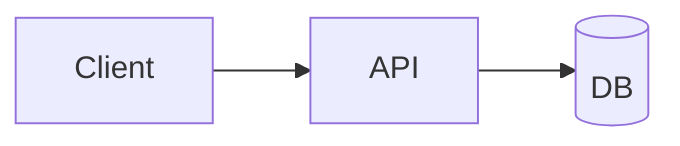

# SlideMark: đề xuất thiết kế (bản nháp)

> Trạng thái: **bản nháp để review**. Tên repo/package đổi sau cũng được.
> Mục tiêu: một thư viện Python để Agent cài vào sandbox, viết văn bản (Markdown mở rộng / HTML / JSON),
> và nhận về file `.pptx` **native, chỉnh sửa được**, dùng được mọi tính năng trình chiếu của PowerPoint.

---

## 1. Định vị: vì sao cần thêm một thư viện nữa?

| Công cụ | PPTX có sửa được không? | Layout đẹp | Thân thiện với Agent |
|---|---|---|---|
| Marp / Slidev | Không, mỗi slide xuất ra thành một ảnh | Có | Trung bình |
| Pandoc (md → pptx) | Có | Yếu, chỉ có vài layout cố định | Trung bình |
| python-pptx | Có | Phải tự tính toạ độ | Kém, API mức thấp |
| pptxgenjs | Có | Phải tự tính toạ độ | Kém, lại cần Node |

Chưa có công cụ nào vừa xuất **PPTX native** (text, chart, table sửa được), vừa có **layout tự động đẹp**,
vừa được **thiết kế cho Agent**: cú pháp dễ đoán, lỗi dễ hiểu, có bước tự kiểm tra và xem trước.
SlideMark nhắm vào khoảng trống đó.

## 2. Nguyên tắc thiết kế

1. **Agent-first.** Cú pháp dựa trên những gì LLM đã thuộc sẵn (Markdown, YAML, Pandoc attributes, HTML/CSS).
   Thông báo lỗi có số dòng và gợi ý cách sửa. Tài liệu cú pháp đi kèm luôn trong package.
2. **Native trước, ảnh là phương án cuối.** Text, shape, table, chart đều là đối tượng PowerPoint thật.
   Chỉ khi không biểu diễn được (HTML tuỳ ý, Mermaid phức tạp) mới render ra ảnh.
3. **Dễ ở mức cơ bản, sâu khi cần.** Một slide đơn giản chỉ cần vài dòng Markdown.
   Khi cần kiểm soát từng pixel thì vẫn có lối thoát: thuộc tính, toạ độ tuyệt đối, HTML, JSON IR, Python API.
4. **Có vòng lặp tự kiểm tra.** `build → check → preview → sửa`. Agent biết slide bị tràn chữ, phần tử nằm ngoài
   khung, chữ khó đọc vì tương phản thấp... trước khi người dùng mở file ra.
5. **Đúng chuẩn OOXML.** File phải mở được trong PowerPoint mà không hiện thông báo "repair".
   Đây là rủi ro kỹ thuật lớn nhất (xem mục 9).
6. **Tiết kiệm token là thước đo giá trị số một.** Mọi cú pháp mới đều phải có số token đo được, và không được làm
   tăng tổng chi phí của Agent. Chi phí ở đây gồm token đọc docs, token sinh deck và token cho các lần sửa lỗi
   (xem mục 4b và 8b).
7. **Mỗi chức năng phải đi qua đủ quy trình kiểm thử** thì mới được tính là xong (xem mục 8).

## 3. Kiến trúc

```
 Markdown+  ─┐
 HTML       ─┼─▶ Parser ─▶ AST ─▶  IR (Pydantic)  ─▶ Layout engine ─▶ Renderer ─▶ .pptx
 JSON/YAML  ─┤                     Deck/Slide/Element   (layout, đo chữ,    (python-pptx +
 Python API ─┘                     (+ JSON Schema)      autofit, theme)     lxml cho OOXML thiếu)
                                          │                                    │
                                          ▼                                    ▼
                                  Validator / Linter                Preview (LibreOffice → PDF → PNG)
```

- **IR (Intermediate Representation)** là phần cốt lõi. Mọi đầu vào đều được chuyển về một mô hình Pydantic
  chung. Từ đó có sẵn JSON Schema để Agent dùng qua tool-calling hoặc MCP. Muốn thêm định dạng đầu vào mới chỉ cần
  viết thêm một parser.
- **Layout engine** chuyển các khai báo như `layout: two-column`, `:::grid`, flex... thành toạ độ EMU.
  Engine đo chữ bằng font metrics thật (fonttools/Pillow) để tự co chữ và phát hiện tràn.
- **Renderer** dùng python-pptx làm nền. Những phần python-pptx chưa hỗ trợ (transition, animation, section,
  action/hyperlink nâng cao, media...) thì viết thẳng OOXML bằng lxml.
- **Backend phụ** (sau này): HTML preview, PDF.

### Thư viện dự kiến

| Mục đích | Thư viện |
|---|---|
| Parse Markdown | `markdown-it-py` + `mdit-py-plugins` (front-matter, attrs, container, dollarmath, footnote) |
| IR và kiểm tra dữ liệu | `pydantic` v2 |
| Ghi PPTX | `python-pptx` + `lxml` |
| Tô màu code | `pygments`, chuyển thành các text run có màu (native, vẫn sửa được) |
| Toán | LaTeX → MathML (`latex2mathml`) → OMML (XSLT), tức là phương trình native của Office |
| Đo chữ | `fonttools` / `Pillow` |
| HTML (extra) | `playwright` (Chromium headless) |
| Preview (extra) | LibreOffice headless → PDF → PNG (`pypdfium2`) |
| CLI | `typer` |

Cài đặt chia theo extras: `pip install slidemark` (lõi nhẹ), `slidemark[html]`, `slidemark[preview]`, `slidemark[all]`.

## 4. Cú pháp đầu vào (phác thảo)

Cú pháp là **Markdown + YAML front-matter + thuộc tính kiểu Pandoc `{...}` + fenced div `:::`**.
LLM đã quen cả bốn thứ này qua Slidev, Marp, Pandoc và MyST.

````markdown
---
theme: midnight            # theme có sẵn, hoặc đường dẫn tới .yaml / .potx / .pptx
size: 16:9
footer: "ACME · Q3 Review"
slide-number: true
---

# Q3 Business Review
## Sales & Growth

???
Speaker notes: chào mọi người, hôm nay...

---
layout: two-column
transition: fade
---

## Doanh thu tăng **32%**

::: left
- APAC **+48%** {.build}
- Khách hàng mới: 1.240 {.build}
- Churn giảm còn 2,1% {.build}
:::

::: right
```chart bar
title: Revenue by quarter
categories: [Q1, Q2, Q3]
series:
  - { name: "2025", data: [10, 12, 15] }
  - { name: "2026", data: [12, 16, 21] }
```
:::

---

## Kiến trúc hệ thống



{x=90% y=5% w=8% alt="ACME logo"}

---
layout: blank
background: "linear-gradient(135deg, #0f172a, #1e3a8a)"
---

```html
<div style="display:flex; gap:24px; padding:48px">
  <div class="card">...</div>
</div>
```
````

Những phần chính của cú pháp:

- `---` để ngắt slide. Khối YAML ngay sau `---` là thuộc tính riêng của slide đó (layout, transition, background, class, hidden...).
- `::: name` là vùng nội dung (region) trong layout: `left`/`right`, `grid cols=3`, `card`, `callout`...
- `{...}` gắn thuộc tính cho từng phần tử: vị trí, kích thước, style, animation (`.build`, `animate=fly-in`), `alt`, `link`.
- Code block có ngôn ngữ đặc biệt sẽ thành đối tượng riêng: `chart`, `table`, `mermaid`, `math`, `html`, `shape`, `icon`, `video`.
- `???` để mở phần speaker notes.

Song song với Markdown, Agent có thể đưa **JSON/YAML theo đúng IR schema** để kiểm soát chính xác tuyệt đối,
hoặc dùng **Python API** (`Deck().slide(...).add_chart(...)`).

## 4b. Thiết kế để Agent tốn ít token nhất

### Số đo ban đầu

Cùng một deck 3 slide (title + notes, bullet kèm bar chart, bảng), đo bằng `bench/count_tokens.py`
với tokenizer proxy `o200k_base`:

| Cách viết | Token | So với python-pptx |
|---|---:|---:|
| SlideMark compact (cú pháp đề xuất) | 158 | **30%** |
| SlideMark verbose (YAML đầy đủ) | 223 | 42% |
| HTML + data-attribute | 321 | 61% |
| Code python-pptx (cách Agent hay làm hiện nay) | 528 | 100% |

Bản python-pptx ở trên chưa hề có theme hay căn chỉnh. Nếu muốn đẹp tương đương thì nó còn dài hơn nhiều,
nên khoảng cách thực tế sẽ lớn hơn con số trong bảng.

### Chi phí cần tối ưu là tổng của cả vòng làm việc

```
Chi phí = token đọc docs/skill (input, đọc một lần)
        + token sinh deck (output, đắt hơn input khoảng 5 lần)
        + số lần sửa × (token đọc lỗi + token sinh lại)
```

Token output đắt nhất, nên ưu tiên giảm nó. Tuy vậy, một cú pháp quá ngắn mà dễ viết sai sẽ làm tăng số lần sửa,
và tổng chi phí khi đó còn cao hơn. Vì vậy luôn đo **tổng chi phí**, không chỉ đo độ dài cú pháp.

### Các quy tắc thiết kế

1. **Mặc định thông minh.** Không khai báo gì thì vẫn ra slide đẹp. Layout được **suy ra từ nội dung**
   (heading + list + chart thì thành hai cột; chỉ có heading thì thành slide section; một con số lớn thì thành big-number).
   Agent chỉ ghi `layout:` khi muốn khác mặc định. Front-matter cũng không bắt buộc.
2. **Dữ liệu viết dạng CSV, không dùng YAML.** Chart viết là ` ```bar ` kèm vài dòng CSV, thay cho khối YAML.
   Bảng nhận cả Markdown lẫn CSV.
3. **Tên ngắn, alias dài vẫn được chấp nhận.** Ví dụ `w`/`width`, `bg`/`background`. Docs chỉ dạy dạng ngắn.
4. **Viết một lần, dùng nhiều lần.** Theme class và component/macro (`@card`, `@kpi 32% "Doanh thu"`)
   thay cho việc lặp lại style inline trên từng slide.
5. **Parser dễ tính.** Chấp nhận các biến thể Agent hay viết (cú pháp Marp/Slidev, `--` thay vì `---`, sai hoa thường...).
   Parser tự sửa và phát cảnh báo thay vì báo lỗi, vì mỗi lần Agent phải sửa đều tốn token.
6. **Thông báo lỗi ngắn gọn và sửa được ngay.** Mỗi lỗi một dòng: `slide 3 L42 overflow: rút còn ≤ 6 bullet hoặc dùng layout two-column`.
7. **Sửa cục bộ.** Mỗi slide có id ổn định. Agent chỉ sửa đúng slide có lỗi (str_replace hoặc `slidemark patch`)
   thay vì sinh lại cả deck.
8. **Docs có ngân sách token.** Ví dụ `SKILL.md` ≤ 1.500 token, mỗi file trong `reference/` ≤ 800 token.
   CI báo lỗi nếu vượt ngân sách.

## 5. Chiến lược hỗ trợ HTML

Dùng hai chế độ, chọn qua thuộc tính `render=native|image` (mặc định là `auto`):

1. **HTML → shape native (mặc định).** Cho Chromium headless (Playwright) render HTML/CSS ở đúng kích thước slide,
   đọc `getBoundingClientRect()` và computed style của từng phần tử, rồi sinh ra shape/text box/ảnh/table native
   tại đúng các toạ độ đó. Trình duyệt lo phần layout, file PPTX vẫn sửa được. Cách này đã được dùng thực tế
   (ý tưởng html2pptx).
2. **HTML → ảnh (fallback).** Những thứ không chuyển được sang native (canvas, SVG phức tạp, CSS filter,
   web font lạ...) thì chụp lại thành PNG/SVG và nhúng vào slide.

Linter sẽ cảnh báo khi một phần tử bị chuyển thành ảnh, để Agent biết phần đó không sửa được.

## 6. Ma trận tính năng PPTX (mục tiêu dài hạn)

| Nhóm | Tính năng |
|---|---|
| Văn bản | font, màu, highlight, super/subscript, list nhiều cấp, đánh số, căn lề, line spacing, autofit, cột chữ, WordArt cơ bản |
| Hình | ~180 autoshape, line/connector, freeform/path, gradient, shadow, glow, xoay, group, z-order |
| Ảnh | crop, mask theo shape, SVG native, độ trong suốt, alt text |
| Bảng | merge cell, style, border, zebra, căn chỉnh |
| Biểu đồ | bar/column/line/area/pie/doughnut/scatter/bubble/radar/combo, nhúng dữ liệu Excel để sửa được |
| Sơ đồ | Mermaid → shape native (đơn giản) hoặc ảnh; sơ đồ kiểu SmartArt (process, cycle, hierarchy) dựng bằng shape |
| Code / Toán | highlight bằng text run native; phương trình OMML native |
| Trình chiếu | transition (fade, push, wipe, morph...), animation (entrance/emphasis/exit/motion path, build từng bullet), trigger |
| Điều hướng | hyperlink, nhảy tới slide khác, action button, mục lục (TOC), section, custom show, hidden slide |
| Media | video, audio (nhúng hoặc link), poster frame |
| Cấu trúc | master/layout, placeholder, footer, số slide, ngày, theme color/font, dùng template .potx của doanh nghiệp |
| Khác | speaker notes, comment, metadata, accessibility (alt text, thứ tự đọc), nhúng font (khó, để sau) |

## 7. Công cụ dành cho Agent

```bash
slidemark build deck.md -o deck.pptx       # build
slidemark check deck.md                    # lint: tràn chữ, ngoài khung, tương phản thấp, quá nhiều chữ, ảnh thiếu alt
slidemark preview deck.md -o out/          # ảnh PNG từng slide để Agent multimodal tự xem lại
slidemark docs [topic]                     # in tài liệu cú pháp ngay trong sandbox, không cần internet
slidemark schema                           # in JSON Schema của IR
slidemark skill install                    # cài SKILL.md cho Claude/Agent
slidemark import deck.pptx -o deck.md      # (sau này) chuyển ngược pptx → markdown để Agent sửa deck có sẵn
```

- Kết quả `check` có dạng JSON (`--format json`), mỗi lỗi kèm `slide`, `line`, `element`, `rule`, `suggestion`.
- **Skill pack** gồm `SKILL.md` ngắn (cú pháp lõi và quy trình làm việc) và thư mục `reference/` chia theo chủ đề
  (charts, layout, animation, html...). Agent chỉ đọc phần mình cần, đỡ tốn context.
  Mọi ví dụ trong docs được chạy trong CI, nên tài liệu không bao giờ lệch với code.
- Sau này có thể thêm MCP server (`slidemark mcp`).

## 8. Quy trình kiểm thử cho từng chức năng

### 8a. Definition of Done: mọi chức năng phải qua đủ 8 bước

| # | Bước | Nội dung | Công cụ |
|---|---|---|---|
| 1 | **Spec và docs trước** | Viết mục docs có ví dụ ngắn nhất có thể. Ghi ngân sách token cho ví dụ đó. | `docs/reference/*.md` |
| 2 | **Parser** | Ví dụ được parse thành đúng IR. Test thêm các biến thể Agent hay viết sai. | pytest |
| 3 | **Fuzz parser** | Đầu vào ngẫu nhiên hoặc hỏng không được làm crash, chỉ được trả lỗi có số dòng. | hypothesis |
| 4 | **Renderer** | Mở lại file .pptx và kiểm tra đúng thuộc tính: toạ độ, font, màu, loại chart, dữ liệu... | python-pptx + lxml |
| 5 | **Hợp lệ OOXML** | XML pass XSD ECMA-376. LibreOffice mở được mà không có lỗi. | xmlschema, soffice |
| 6 | **Golden snapshot** | So XML đã chuẩn hoá và ảnh render (perceptual diff, có ngưỡng) với bản golden. | pytest-snapshot, pixelmatch |
| 7 | **Lint** | Nếu chức năng có thể gây lỗi hiển thị (tràn, chồng lấn...) thì phải có rule trong `check` kèm test. | pytest |
| 8 | **Bench** | Chạy bench. Không có metric nào xấu đi quá ngưỡng, trừ khi PR ghi rõ lý do. | `bench/` |

Mỗi chức năng có một dòng trong `docs/FEATURES.md` (ma trận tính năng). Dòng đó ghi trạng thái của 8 bước trên,
nên nhìn vào là biết chức năng nào mới làm một nửa.

### Các tầng test và lúc chạy

| Tầng | Chạy khi nào | Thời gian |
|---|---|---|
| Unit, parser, renderer, lint, docs-example, ngân sách token | Mỗi commit (CI) | < 1 phút |
| XSD và golden XML | Mỗi commit (CI) | < 2 phút |
| Golden ảnh qua LibreOffice | Mỗi PR | vài phút |
| Agent eval (gọi model thật, tốn tiền) | Hằng ngày hoặc hằng tuần, chạy tay khi đổi cú pháp | tuỳ quy mô |
| Thử trên PowerPoint thật | Mỗi milestone (thủ công) | — |

## 8b. Đo lường và tối ưu hằng ngày

### Các chỉ số cốt lõi

| Nhóm | Chỉ số | Mục tiêu |
|---|---|---|
| **Token: cú pháp** | Số token của từng deck trong corpus, so với baseline python-pptx/HTML | Giảm dần, không được tăng |
| **Token: docs** | Số token của SKILL.md và từng file reference | ≤ ngân sách |
| **Token: Agent thật** | input / output / tổng token để ra một deck pass `check` | Giảm dần |
| **Độ tin cậy** | Tỷ lệ pass ngay lần đầu, số vòng sửa trung bình, tỷ lệ lỗi parse | Tăng / giảm / giảm |
| **Chất lượng** | Số vi phạm `check` trên mỗi deck, độ lệch ảnh golden | Giảm |
| **Hiệu năng** | Thời gian build/slide, thời gian import, dung lượng cài đặt, số dependency | Nhỏ, vì Agent cài trong sandbox mỗi lần |
| **Độ phủ** | Coverage test, số ô hoàn thành trong ma trận tính năng | Tăng |

### Lưu trữ

```
bench/
  corpus/<deck>/            # cùng một deck viết bằng nhiều cách: slidemark-compact, verbose, html, python-pptx
  tasks/<task>.md           # đề bài cho Agent eval (ví dụ "làm deck 8 slide báo cáo Q3 từ dữ liệu sau...")
  count_tokens.py           # đo token cú pháp (proxy o200k_base offline; số chính xác của Claude nếu có API key)
  history.jsonl             # append-only: date, commit, metric, deck/task, giá trị, tokenizer
  BASELINE.json             # giá trị tốt nhất hiện tại, CI so với file này để phát hiện regression
  report.py                 # (sau này) vẽ biểu đồ xu hướng từ history.jsonl
```

- `history.jsonl` được commit vào git, mỗi dòng gắn với một commit, nên lúc nào cũng truy được thay đổi nào làm
  metric tốt lên hay xấu đi.
- CI fail khi một metric xấu đi quá ngưỡng so với `BASELINE.json` (ví dụ token tăng > 2%).
  Muốn chấp nhận thì phải cập nhật baseline trong cùng PR và ghi lý do.
- Số token proxy chỉ để so sánh tương đối (ổn định, chạy offline). Số token chính xác lấy từ Claude
  `count_tokens` API và từ usage trong Agent eval.

### Vòng lặp hằng ngày

1. Làm một task trong lộ trình, đi đủ 8 bước của Definition of Done.
2. Chạy `python bench/count_tokens.py --record` (sau này gom vào `make bench`).
3. So với hôm trước. Nếu metric xấu đi thì sửa luôn, hoặc ghi lý do vào commit.
4. Mỗi tuần chạy Agent eval một lần, dựa vào kết quả để chọn chỗ tối ưu cho tuần sau
   (ví dụ: cú pháp nào Agent hay viết sai nhất thì làm parser dễ tính hơn hoặc rút gọn cú pháp đó).

## 9. Rủi ro và cách giảm

| Rủi ro | Cách giảm |
|---|---|
| LibreOffice mở được nhưng PowerPoint báo lỗi | Validate XSD; viết XML theo mẫu lấy từ file do PowerPoint tạo ra; định kỳ kiểm tra thủ công trên PowerPoint thật |
| Đo chữ không khớp với PowerPoint, dẫn đến tràn chữ | Dùng font metrics thật, để biên an toàn; kết hợp autofit `normAutofit` |
| Animation/timing XML rất phức tạp | Dựng từ các preset có sẵn, không cố cover toàn bộ đặc tả |
| Phạm vi quá lớn | Làm theo milestone, mỗi ngày một task nhỏ có test |
| Font không có trong sandbox | Bundle một bộ font mở (Inter, Noto, kể cả Noto cho tiếng Việt/CJK) dùng khi đo và preview |

## 10. Lộ trình (mỗi milestone chia thành task làm trong một ngày)

**M0: Nền móng**
- [ ] Skeleton package (`src/` layout, `pyproject.toml`, uv), ruff, pytest, CI
- [x] Bench v0: corpus đầu tiên, `count_tokens.py`, `history.jsonl`
- [ ] `BASELINE.json` và CI gate chặn regression token; `docs/FEATURES.md` (ma trận Definition of Done)
- [ ] Harness test chung: helper mở pptx để assert, validate XSD, golden XML/ảnh
- [ ] Định nghĩa IR v0: Deck, Slide, TextBox, Paragraph/Run, Image, Table, Notes
- [ ] Renderer v0: IR → pptx (title, bullet, image, notes)

**M1: MVP Markdown → PPTX**
- [ ] Parser: front-matter, ngắt slide, heading, list nhiều cấp, inline formatting, ảnh, bảng, notes
- [ ] Theme v0 (màu, font, kích thước) kèm 2–3 theme mẫu
- [ ] CLI `build`
- [ ] Golden test đầu tiên

**M2: Layout và theme**
- [ ] Layout có sẵn: title, section, two-column, image-left/right, grid, quote, big-number, blank
- [ ] Fenced div `:::` và thuộc tính `{}`
- [ ] Đo chữ và autofit
- [ ] Dùng template `.potx`/`.pptx` của người dùng (map placeholder)

**M3: Nội dung phong phú**
- [ ] Chart native (bar/line/pie → các loại còn lại)
- [ ] Code highlight native
- [ ] Toán OMML
- [ ] Mermaid (ảnh trước, shape native sau)
- [ ] Shape, icon, callout, card

**M4: Vòng lặp cho Agent** (nên làm sớm, có thể chen vào sau M1)
- [ ] Agent eval harness: chạy các task trong `bench/tasks` bằng model thật, ghi token/vòng sửa/pass rate vào history
- [ ] `check` linter và đầu ra JSON
- [ ] `preview` PNG
- [ ] `docs`, `schema`, SKILL.md và reference/
- [ ] Thông báo lỗi có số dòng và gợi ý sửa

**M5: HTML**
- [ ] HTML → native bằng cách đo trong Chromium
- [ ] Fallback HTML → ảnh

**M6: Tính năng trình chiếu**
- [ ] Transition, animation, build từng bullet
- [ ] Hyperlink, nhảy slide, action button, section, hidden slide
- [ ] Video/audio

**M7: Nâng cao**
- [ ] Sơ đồ kiểu SmartArt, chỉnh sửa master
- [ ] Import pptx → markdown
- [ ] MCP server, xuất PDF

## 11. Các quyết định cần chốt

1. **Cú pháp slide-level**: dùng YAML sau `---` (kiểu Slidev, Agent đã quen) hay comment directive `<!-- layout: x -->` (kiểu Marp)?
   Đề xuất: **kiểu Slidev**.
2. **Ngôn ngữ của docs và code**: tiếng Anh (để mở cộng đồng, và Agent đọc chính xác hơn) hay tiếng Việt?
   Đề xuất: **code và docs bằng tiếng Anh**, ghi chú thiết kế nội bộ có thể dùng tiếng Việt.
3. **Phiên bản Python tối thiểu**: đề xuất 3.10+.
4. **License**: MIT hay Apache-2.0?
5. **Tên package trên PyPI**: kiểm tra xem tên còn trống không trước khi publish.
