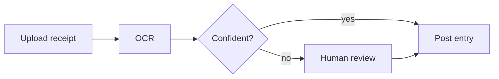

theme: midnight
lang: en
num: on

# Shipping LedgerAI
AI bookkeeping for small businesses

# Traction
> MRR grew 5× in four quarters with flat CAC
## MRR {.kpi}
$52k
+68% QoQ
## Customers {.kpi}
1,240
+410 this quarter
## Churn {.kpi}
1.8%
target < 2%
@end
```column {title="MRR (k USD)" labels=on legend=none}
,Q1,Q2,Q3,Q4
MRR,10,18,31,52
```

# How a receipt becomes a ledger entry

> [!tip] 92% of receipts post without a human

# Pricing model
```math
\text{LTV} = \frac{\text{ARPA} \times m}{c}
```
## Assumptions
- ARPA = $42 / month
- Gross margin m = 81%
- Monthly churn c = 1.8%
- LTV ≈ ==$1,890==

# API in one call
```python
from ledgerai import Client

client = Client(api_key="...")
entry = client.receipts.post("receipt.jpg")
print(entry.account, entry.amount)
```
- One endpoint, idempotent by receipt hash
- Webhooks for review results
