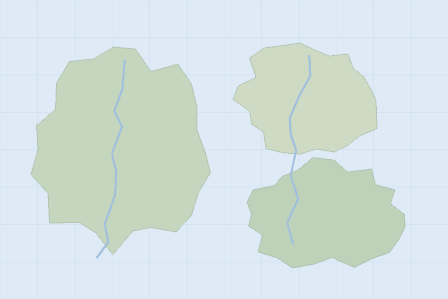

theme: none
colors: bg=#FFFFFF fg=#1D2433 primary=#1F3A68 secondary=#3C7DD9 accent=#E8A33D success=#2E9E6B danger=#D1495B surface=#F1F4F9 border=#D4DBE8 muted=#5A6577
fonts: heading=Arial body=Arial
sizes: title=30 lead=20 body=18 footnote=11
style: radius=8 title.band=none iconlist.icon.color=secondary quote.mark.color=accent proscons.plus.color=success proscons.minus.color=danger progress.fill=primary progress.track=surface harvey.fill=primary pins.fill=accent split.gap=0.45in
footer: Orbit Studio · Q3 review
num: on

# Orbit Studio: Q3 review
Product, customers and delivery · October 2026

# Why teams switch to Orbit
> Four reasons customers give in their exit interviews
@iconlist cols=2 noemph
- icon=bolt **Faster builds** median 38 s instead of 4 minutes
- icon=shield **Safer releases** every deploy is signed and can be rolled back
- icon=users **One shared board** design, QA and ops see the same state
- icon=chart **Honest numbers** cost per release is on the dashboard

# What customers say
@quote align=center noemph
> "We stopped arguing about the deck and started arguing about the product."
> — Mika Tanaka, Head of Product at Northwind

# A studio built for focus
@split side=right ratio=1:1 bleed=on noemph
> Quiet floors and one shared board

- 3 floors, 140 desks
- Maker hours 09:00 to 13:00
- Demo Friday at 16:00

# Build or buy the billing engine?
@proscons noemph defaults
## Why buy
+ Live in eight weeks
+ Tax rules kept current by the vendor
+ Engineers stay on the product
## Why build
− Nine months of engineering
− We own every outage
− A 0.4% fee we would avoid later
> Verdict: buy now and revisit in 2028, when volume passes 3M invoices

# Delivery at the end of Q3
@progress max=100 noemph defaults
- Billing engine 92%
- Self-serve onboarding 74%
- Audit log export 58%
- Mobile approvals 31%
- Partner API 12%

# Vendor fit by criterion
@harvey noemph defaults
| Vendor | Price | Coverage | Support | Roadmap |
|---|---|---|---|---|
| Ledgerly | 4 | 3 | 2 | 3 |
| Paybridge | 2 | 4 | 4 | 3 |
| Nimbus Bill | 3 | 2 | 1 | 4 |
| Build in-house | 1 | 4 | 3 | 2 |

# Weekly active teams by region and plan
@heatmap min=0 max=100 colors=#F3F6FA,primary noemph defaults
| Region | Free | Team | Business | Enterprise |
|---|---|---|---|---|
| Japan | 22 | 48 | 71 | 93 |
| Vietnam | 31 | 44 | 52 | 60 |
| Europe | 18 | 39 | 66 | 84 |
| Americas | 12 | 27 | 49 | 77 |

# Where we work
@pins legend=right noemph

- x=26% y=36% **Harbor HQ** product and design
- x=71% y=27% **Delta Lab** research
- x=63% y=71% **Ridge Support** 24/7 desk
- x=36% y=64% **East Depot** hardware
