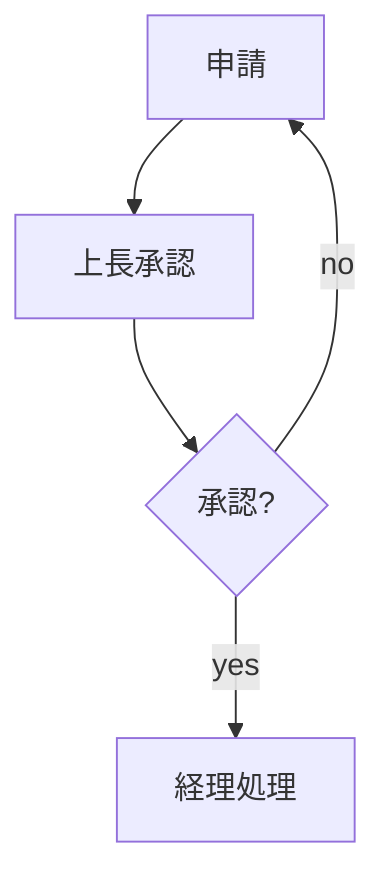

# Components

**KPI cards** — big number + caption; the heading is the label. Four in a row, then a table:

```markdown
@4
## 売上高 {.kpi}
62.4億円
計画比 +6.2%
## 営業利益 {.kpi}
8.1億円
計画比 +11.0%
## 顧客数 {.kpi}
312社
前年比 +24%
## 解約率 {.kpi}
1.6%
前年 2.1%
@end
| 事業部 | 売上 | 評価 |
|-|-|-|
| SaaS | 38.2 | [好調]{.badge .success} |
```

**Steps** — `@4 chevron` draws each box as a chevron (heading + 1–3 short bullets). `@3 flow` keeps cards and
puts arrows between them. Add `@end` and a table to get a plan table under the steps.

**Connectors** — `@` tokens `a>b` (arrow) or `a-b` (line) between blocks in source order. Org chart:

```markdown
@.a./bcd a>b a>c a>d
## 社長
## 営業
## 開発
## 管理
```

**Flowcharts** — branches and loops go in a Mermaid fence; nodes become native shapes:

````markdown

````

**Callouts** — `> [!note]`, `> [!tip]`, `> [!warn]`, `> [!caution]` + text: tinted box with a colored bar.
Works at slide level (full width, below the grid) and inside boxes.
Badges work anywhere in text, including bullets and table cells (`影響: [高]{.badge .danger}`).

**Badges** — `[NEW]{.badge}`, color with a class: `.success .danger .accent .muted`.

**Box colors** — `## 課題 {.danger}` colors the box border; `{.plain}` removes the card.

**Lead / conclusion / footnotes** — `>` first = key message under the title, `>` last = bar at the bottom,
`※` lines = small notes at the bottom.
